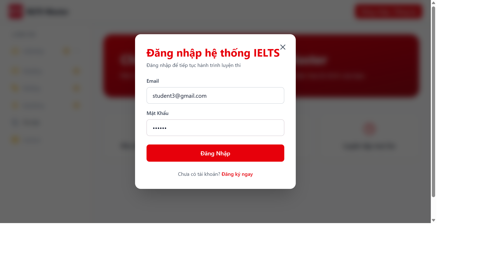
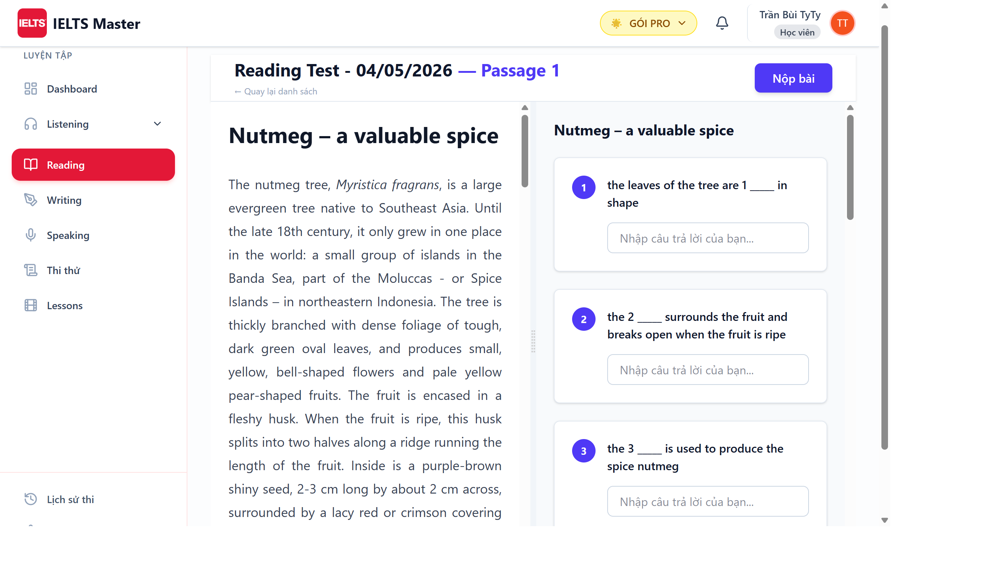
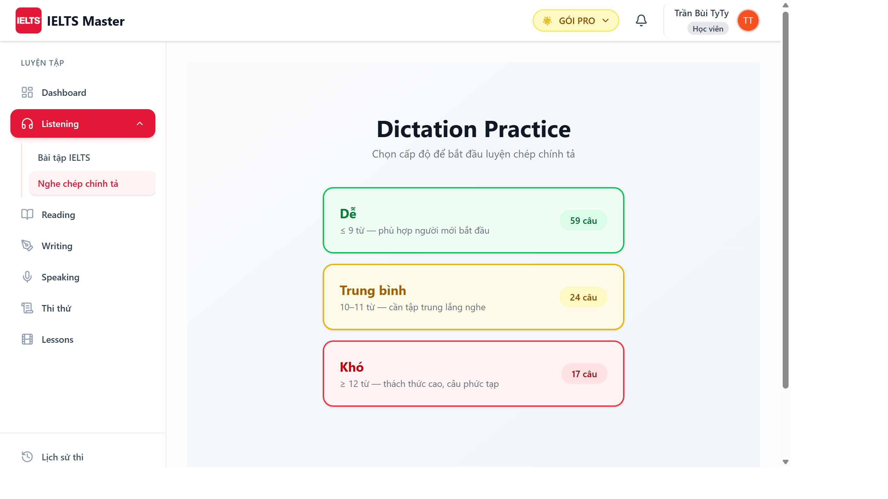
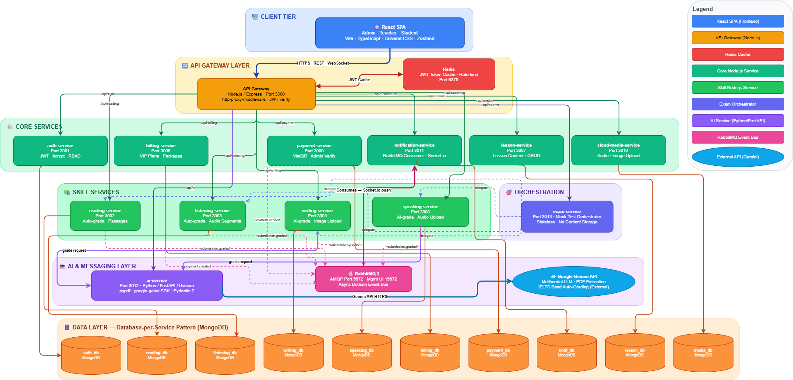
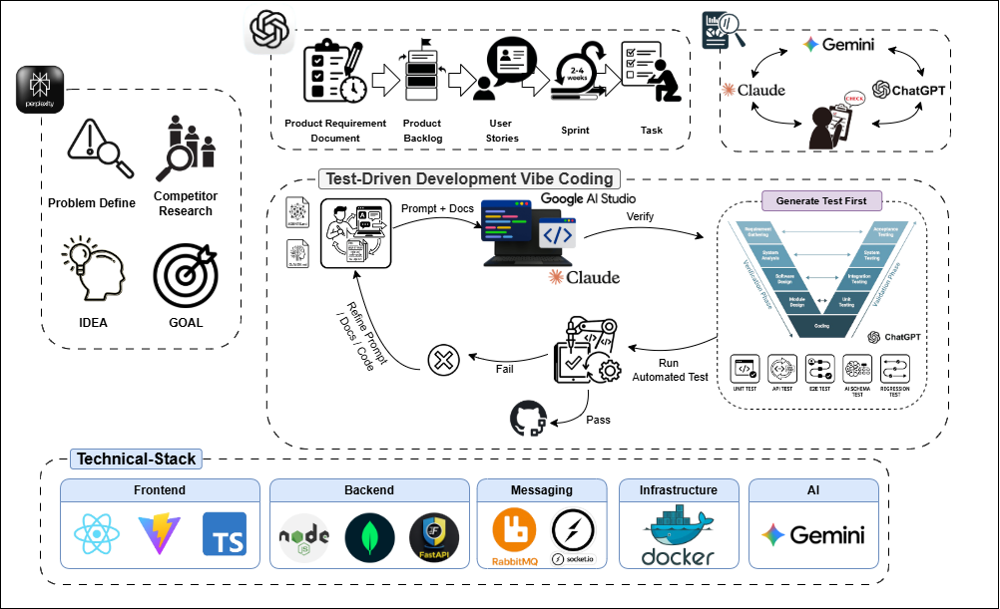

# IELTS-Mate Platform

> AI-powered IELTS practice platform — full mock tests, automated grading, and learning analytics.

[](LICENSE)
[](https://nodejs.org)
[](https://python.org)
[](https://docker.com)

---

## Screenshots

| Auth & Dashboard | Reading Test |
|---|---|
|  |  |

| Listening Dictation | Writing Grading |
|---|---|
|  |  |

| Speaking Practice | Mock Exam |
|---|---|
|  |  |

| Teacher Dashboard | Admin Analytics |
|---|---|
|  |  |

---

## Features

- **AI Reading Tests** — Gemini AI generates IELTS-standard passages with MCQ, True/False/NG, Matching Headings, and Fill-in-the-blank at configurable band levels (5.0–9.0).
- **Listening & Dictation** — 4-section audio tests with punctuation-aware auto-grading.
- **AI Writing Grading** — Task 1 & Task 2 scored against official criteria via async RabbitMQ pipeline.
- **Speaking Assessment** — Recorded responses evaluated by Gemini with per-criterion band scores.
- **Full Mock Exams** — Combined 4-skill timed exams with aggregate band score calculation.
- **Lesson Library** — Video-based courses with progress tracking.
- **Subscription Billing** — VietQR-based payment, plan enforcement, and per-user API key quotas.
- **Teacher Tools** — PDF extraction, test builder, manual grading override.
- **Admin Panel** — User management, AI model configuration, platform analytics.

---

## Architecture

[](screenshots/System-architecture.png)

Each service owns its own MongoDB database. No cross-service direct DB access.

---

## Proposed Method

[](screenshots/Proposed-method.png)

---

## Tech Stack

| Layer | Technology |
|---|---|
| Frontend | React 18, TypeScript, Tailwind CSS, Zustand, TanStack Query, Recharts |
| API Gateway | Node.js 20, Express 5 |
| Backend Services | Node.js 20, Express 5, Mongoose 8 |
| AI Service | Python 3.11, FastAPI, Pydantic v2, Google Gemini |
| OCR | PaddleOCR |
| Auth | JWT + refresh token rotation |
| Cache / Rate Limit | Redis + ioredis |
| Message Broker | RabbitMQ (AMQP) |
| Storage / CDN | Cloudinary |
| Database | MongoDB Atlas (database-per-service) |
| Containerisation | Docker + Docker Compose |

---

## Project Structure

```
ielts/
+-- fe/                       # React SPA (Vite + TypeScript)
+-- be/
    +-- docker-compose.yml    # Full stack orchestration
    +-- api-gateway/          # :3000 — request routing & auth proxy
    +-- auth-service/         # :3001 — JWT, RBAC, API key quotas
    +-- reading-service/      # :3002 — tests, AI generation, auto-grading
    +-- listening-service/    # :3003 — audio tests, dictation
    +-- writing-service/      # :3004 — AI grading via RabbitMQ
    +-- billing-service/      # :3005 — subscriptions, plan enforcement
    +-- speaking-service/     # :3006 — recording upload, AI scoring
    +-- lesson-service/       # :3007 — courses, video content
    +-- payment-service/      # :3008 — VietQR payment gateway
    +-- notification-service/ # :3009 — email / push via RabbitMQ
    +-- cloud-media-service/  # :3010 — file uploads, presigned URLs
    +-- exam-service/         # :3013 — full mock exams
    +-- ai-service/           # :8000 — FastAPI, Gemini, OCR
```

---

## Getting Started

### Prerequisites

- Docker 24+ and Docker Compose v2
- Node.js 20 LTS (frontend only)
- Google Gemini API key ([get one here](https://aistudio.google.com/app/apikey))
- MongoDB Atlas cluster (free tier works)

### 1. Clone

```bash
git clone https://github.com/Ielts-Learning-System/09032026.git
cd 09032026
```

### 2. Configure environment variables

```bash
# Root config (docker-compose variable substitution)
cp ielts/be/.env.example ielts/be/.env

# Per-service configs
for svc in auth-service billing-service cloud-media-service exam-service \
           lesson-service listening-service notification-service payment-service \
           reading-service speaking-service writing-service ai-service; do
  cp ielts/be/$svc/.env.example ielts/be/$svc/.env
done

# Frontend
cp ielts/fe/.env.example ielts/fe/.env
```

Edit each `.env` with your real credentials (MongoDB URI, Gemini API key, JWT secret, etc.).

### 3. Start all services

```bash
cd ielts/be
docker compose up -d --build
```

Services start in dependency order: MongoDB → Redis → RabbitMQ → microservices.

### 4. Start frontend (development)

```bash
cd ielts/fe
npm ci
npm run dev
```

Frontend available at `http://localhost:5173`.

---

## Frontend Deployment (Vercel)

The `ielts/fe` folder is a Vite SPA configured for one-click Vercel deployment.

Vercel settings (auto-detected via `vercel.json`):

| Setting | Value |
|---|---|
| Framework | Vite |
| Root Directory | `ielts/fe` |
| Build Command | `npm run build` |
| Output Directory | `dist` |

Set the environment variable `VITE_API_URL` in your Vercel project dashboard to point to your deployed API Gateway.

---

## Environment Variables Reference

### Backend root (`.env`)

| Variable | Description |
|---|---|
| `MONGO_URI_*` | MongoDB Atlas URI for each service's database |
| `JWT_SECRET` | Shared JWT signing secret |
| `RABBITMQ_URL` | RabbitMQ connection string |
| `REDIS_URL` | Redis connection string |
| `CLOUDINARY_*` | Cloudinary credentials for file uploads |
| `VIETQR_*` | VietQR bank account details |

### AI Service

| Variable | Description |
|---|---|
| `GEMINI_API_KEY` | Google AI Studio API key |
| `GEMINI_MODEL` | Model name (default: `gemini-2.5-flash`) |
| `INTERNAL_SECRET` | Shared service-to-service auth token |

### Frontend

| Variable | Description |
|---|---|
| `VITE_API_URL` | Full URL of the API Gateway |

---

## Health Checks

Every service exposes `GET /health`:

```json
{ "status": "ok", "service": "auth-service", "timestamp": "2026-05-20T10:00:00.000Z" }
```

---

## License

MIT © 2026 IELTS Learning System
