# IELTS Learning Platform — System Architecture

> **Pattern**: Microservices · Database-per-Service  
> **Transport**: REST (sync) + RabbitMQ (async) + Socket.io (real-time)  
> **Deployment**: Docker Compose

---

## Architecture Diagram

```mermaid
graph TD
    classDef ui       fill:#3B82F6,stroke:#1E40AF,color:#ffffff,font-weight:bold
    classDef gateway  fill:#F59E0B,stroke:#B45309,color:#000000,font-weight:bold
    classDef cache    fill:#EF4444,stroke:#B91C1C,color:#ffffff,font-weight:bold
    classDef core     fill:#10B981,stroke:#047857,color:#ffffff,font-weight:bold
    classDef skill    fill:#22C55E,stroke:#15803D,color:#ffffff,font-weight:bold
    classDef orch     fill:#6366F1,stroke:#4338CA,color:#ffffff,font-weight:bold
    classDef ai       fill:#8B5CF6,stroke:#6D28D9,color:#ffffff,font-weight:bold
    classDef external fill:#0EA5E9,stroke:#0369A1,color:#ffffff,font-weight:bold
    classDef broker   fill:#EC4899,stroke:#BE185D,color:#ffffff,font-weight:bold
    classDef db       fill:#FB923C,stroke:#C2410C,color:#ffffff,font-weight:bold

    %% ──────────────────────────────────────────────────────────────────
    %%  CLIENT TIER
    %% ──────────────────────────────────────────────────────────────────
    subgraph CLIENT["🖥️  CLIENT TIER"]
        FE["⚛️ React SPA\nAdmin · Teacher · Student\nVite · TypeScript · Tailwind CSS"]
    end

    %% ──────────────────────────────────────────────────────────────────
    %%  API GATEWAY LAYER
    %% ──────────────────────────────────────────────────────────────────
    subgraph GWLAYER["🔀  API GATEWAY LAYER"]
        GW["API Gateway\nNode.js / Express  :3000\nhttp-proxy-middleware"]
        REDIS[("Redis\nJWT Cache · Rate-Limit\nSession Store")]
    end

    %% ──────────────────────────────────────────────────────────────────
    %%  MICROSERVICES LAYER
    %% ──────────────────────────────────────────────────────────────────
    subgraph SVCLAYER["⚙️  MICROSERVICES LAYER"]

        subgraph CORE["Core Services"]
            AUTH["auth-service\n:3001"]
            BILLING["billing-service\n:3005"]
            PAYMENT["payment-service\n:3009"]
            NOTIF["notification-service\n:3011"]
            LESSON["lesson-service\n:3007"]
            MEDIA["cloud-media-service\n:3010"]
        end

        subgraph SKILLS["Skill Services"]
            READ["reading-service\n:3002"]
            LISTEN["listening-service\n:3003"]
            WRITE["writing-service\n:3004"]
            SPEAK["speaking-service\n:3008"]
        end

        subgraph ORCHSUB["Orchestration"]
            EXAM["exam-service  :3013\nMock-Test Orchestrator\nStateless · No Content Storage"]
        end

    end

    %% ──────────────────────────────────────────────────────────────────
    %%  EVENT BUS
    %% ──────────────────────────────────────────────────────────────────
    subgraph BUSLAYER["📨  EVENT BUS"]
        MQ["🐰 RabbitMQ\nAsync Domain Events\n:5672 / UI :15672"]
    end

    %% ──────────────────────────────────────────────────────────────────
    %%  AI LAYER
    %% ──────────────────────────────────────────────────────────────────
    subgraph AILAYER["🤖  AI LAYER"]
        AISC["ai-service\nPython · FastAPI · Uvicorn\n:3012"]
        GEMINI["☁️ Google Gemini API\nPDF Extraction · Auto-Grading\ngoogle-genai · pypdf"]
    end

    %% ──────────────────────────────────────────────────────────────────
    %%  DATA LAYER
    %% ──────────────────────────────────────────────────────────────────
    subgraph DATALAYER["🗄️  DATA LAYER — Database-per-Service Pattern"]
        DB_AUTH[("auth_db\nMongoDB")]
        DB_READ[("reading_db\nMongoDB")]
        DB_LISTEN[("listening_db\nMongoDB")]
        DB_WRITE[("writing_db\nMongoDB")]
        DB_SPEAK[("speaking_db\nMongoDB")]
        DB_BILL[("billing_db\nMongoDB")]
        DB_PAY[("payment_db\nMongoDB")]
        DB_NOTIF[("notif_db\nMongoDB")]
        DB_LESSON[("lesson_db\nMongoDB")]
        DB_MEDIA[("media_db\nMongoDB")]
    end

    %% ──────────────────────────────────────────────────────────────────
    %%  SYNCHRONOUS REST FLOWS
    %% ──────────────────────────────────────────────────────────────────
    FE -->|"HTTPS · REST · WebSocket"| GW
    GW <-->|"JWT Cache"| REDIS

    GW --> AUTH
    GW --> READ
    GW --> LISTEN
    GW --> WRITE
    GW --> SPEAK
    GW --> BILLING
    GW --> PAYMENT
    GW --> NOTIF
    GW --> LESSON
    GW --> MEDIA
    GW --> AISC
    GW --> EXAM

    %% ──────────────────────────────────────────────────────────────────
    %%  EXAM ORCHESTRATION
    %% ──────────────────────────────────────────────────────────────────
    EXAM -->|"sub-test delegation"| READ
    EXAM -->|"sub-test delegation"| LISTEN
    EXAM -->|"sub-test delegation"| WRITE
    EXAM -->|"sub-test delegation"| SPEAK

    %% ──────────────────────────────────────────────────────────────────
    %%  AI GRADING PIPELINE
    %% ──────────────────────────────────────────────────────────────────
    WRITE -->|"grade request"| AISC
    SPEAK -->|"grade request"| AISC
    AISC  -->|"Gemini API call"| GEMINI

    %% ──────────────────────────────────────────────────────────────────
    %%  ASYNC EVENT BUS FLOWS
    %% ──────────────────────────────────────────────────────────────────
    BILLING  -->|"payment.created"| MQ
    PAYMENT  -->|"payment.verified"| MQ
    WRITE    -->|"submission.graded"| MQ
    SPEAK    -->|"submission.graded"| MQ
    READ     -->|"submission.graded"| MQ
    LISTEN   -->|"submission.graded"| MQ
    MQ       -->|"Consumes → push notification"| NOTIF

    %% ──────────────────────────────────────────────────────────────────
    %%  DATA PERSISTENCE
    %% ──────────────────────────────────────────────────────────────────
    AUTH    --- DB_AUTH
    READ    --- DB_READ
    LISTEN  --- DB_LISTEN
    WRITE   --- DB_WRITE
    SPEAK   --- DB_SPEAK
    BILLING --- DB_BILL
    PAYMENT --- DB_PAY
    NOTIF   --- DB_NOTIF
    LESSON  --- DB_LESSON
    MEDIA   --- DB_MEDIA

    %% ──────────────────────────────────────────────────────────────────
    %%  STYLE APPLICATION
    %% ──────────────────────────────────────────────────────────────────
    class FE ui
    class GW gateway
    class REDIS cache
    class AUTH,BILLING,PAYMENT,NOTIF,LESSON,MEDIA core
    class READ,LISTEN,WRITE,SPEAK skill
    class EXAM orch
    class AISC ai
    class GEMINI external
    class MQ broker
    class DB_AUTH,DB_READ,DB_LISTEN,DB_WRITE,DB_SPEAK,DB_BILL,DB_PAY,DB_NOTIF,DB_LESSON,DB_MEDIA db
```

---

## Architectural Decisions

### Communication Patterns

| Pattern | Used By | Reason |
|:--------|:--------|:-------|
| **Synchronous REST** | All client-initiated requests via API Gateway | Immediate response required (e.g., submit answer, fetch question) |
| **Asynchronous Events (RabbitMQ)** | Grading completion, payment verification, notifications | Decouples producers from consumers; notification failure never blocks grading |
| **WebSocket (Socket.io)** | Real-time push from `notification-service` to browser | Eliminates polling; delivers instant grading-complete and VIP-activated alerts |

### Key Design Patterns

| Pattern | Implementation |
|:--------|:--------------|
| **API Gateway** | Single entry point `:3000`; JWT validation via Redis; `http-proxy-middleware` for zero-body-loss proxying |
| **Database-per-Service** | 10 isolated MongoDB instances; no cross-service DB queries |
| **Stateless Orchestration** | `exam-service` coordinates full mock tests by delegating to skill services without storing question content |
| **Event-Driven Notifications** | All domain events flow through RabbitMQ → `notification-service` → Socket.io push |
| **Sidecar AI** | `ai-service` is an isolated Python/FastAPI sidecar; no direct DB access to skill service data |

---

## Port Reference

| Service | Port | Language / Framework |
|:--------|:----:|:---------------------|
| API Gateway | 3000 | Node.js / Express |
| auth-service | 3001 | Node.js / Express |
| reading-service | 3002 | Node.js / Express |
| listening-service | 3003 | Node.js / Express |
| writing-service | 3004 | Node.js / Express |
| billing-service | 3005 | Node.js / Express |
| lesson-service | 3007 | Node.js / Express |
| speaking-service | 3008 | Node.js / Express |
| payment-service | 3009 | Node.js / Express |
| cloud-media-service | 3010 | Node.js / Express |
| notification-service | 3011 | Node.js / Express |
| ai-service | 3012 | Python / FastAPI |
| exam-service | 3013 | Node.js / Express |
| RabbitMQ AMQP | 5672 | — |
| RabbitMQ Management UI | 15672 | — |
| Redis | 6379 | — |
