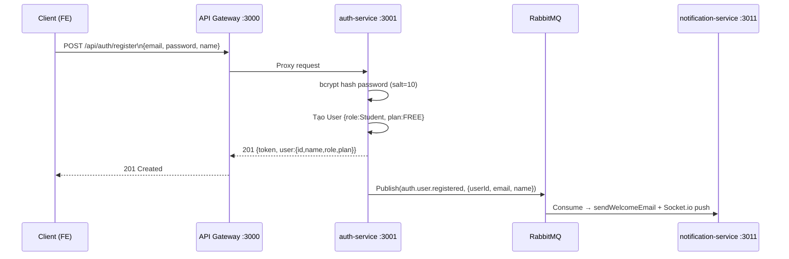
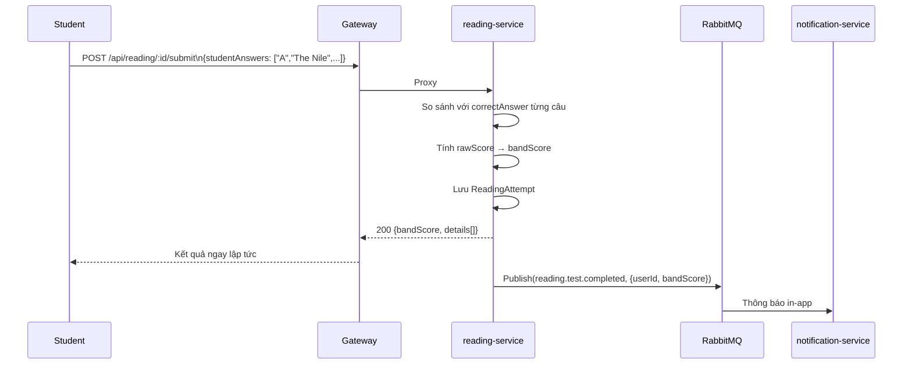
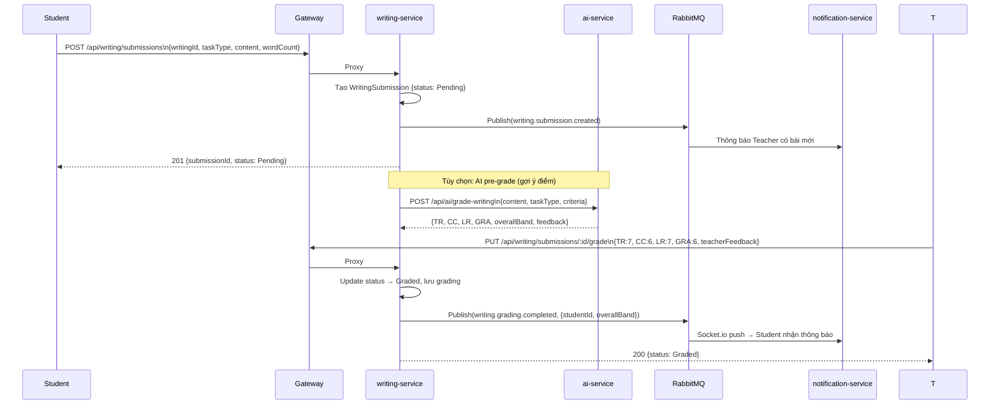
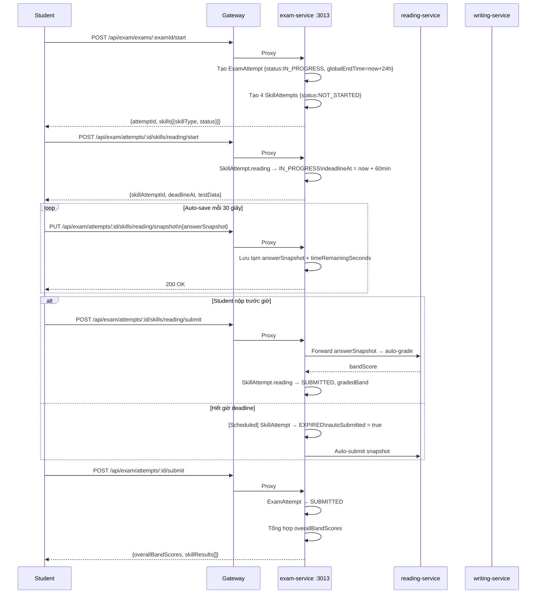
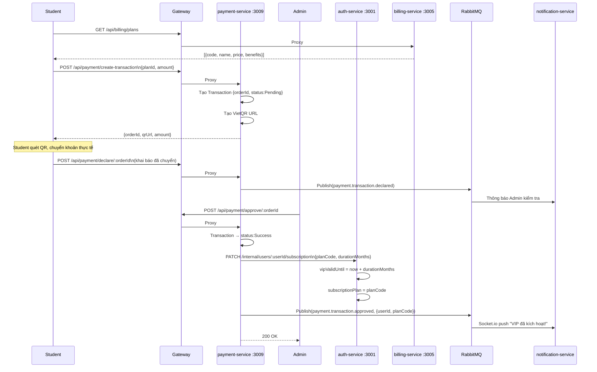
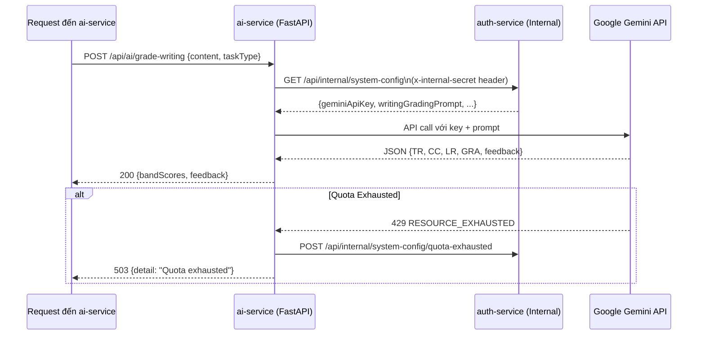
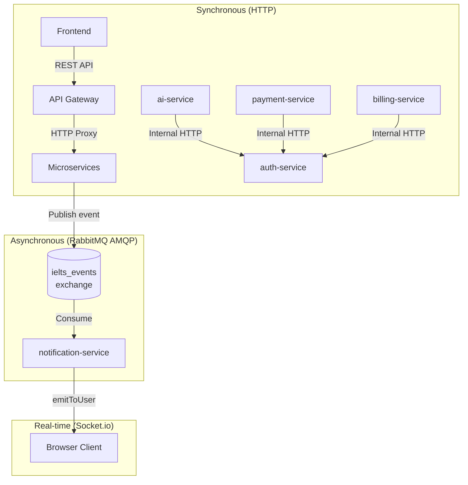

# Hợp đồng API & Giao tiếp Dịch vụ
## Nền tảng Luyện thi IELTS — API Contract

> **Phiên bản:** 1.0 · **Giao thức:** REST over HTTP + RabbitMQ AMQP + Socket.io  
> **Base URL:** `http://localhost:3000` (API Gateway) hoặc domain production

---

## 1. Quy ước Chung

| Quy ước | Giá trị |
|:--------|:--------|
| **Content-Type** | `application/json` (mặc định) |
| **Xác thực** | `Authorization: Bearer <JWT>` cho mọi route được bảo vệ |
| **Mã lỗi** | HTTP standard (200, 201, 400, 401, 403, 404, 500) |
| **Định dạng Response lỗi** | `{ "success": false, "message": "..." }` |
| **Định dạng Response thành công** | `{ "success": true, "data": {...} }` |
| **Internal routes** | Không qua Gateway; gọi trực tiếp qua Docker DNS |

---

## 2. Auth Service API (`/api/auth`, `/api/users`)

### 2.1 Luồng Đăng ký & Đăng nhập



### 2.2 Bảng API Auth

| Method | Path | Auth | Role | Mô tả |
|:-------|:-----|:-----|:-----|:------|
| POST | `/api/auth/register` | ❌ Public | — | Đăng ký tài khoản mới |
| POST | `/api/auth/login` | ❌ Public | — | Đăng nhập, nhận JWT |
| GET | `/api/auth/profile` | ✅ JWT | Any | Xem thông tin cá nhân |
| PUT | `/api/auth/profile` | ✅ JWT | Any | Cập nhật tên, avatar |
| PUT | `/api/auth/change-password` | ✅ JWT | Any | Đổi mật khẩu |
| PUT | `/api/auth/update-role/:id` | ✅ JWT | Admin | Thay đổi role user |
| GET | `/api/users` | ✅ JWT | Admin, Teacher | Danh sách tất cả users |
| GET | `/api/users/stats` | ✅ JWT | Admin | Thống kê tài khoản |
| POST | `/api/users/lookup` | ✅ JWT | Admin, Teacher | Tra cứu user theo IDs |
| PUT | `/api/users/:id/role` | ✅ JWT | Admin | Đặt lại role |
| PUT | `/api/users/:id/status` | ✅ JWT | Admin | Khoá / mở tài khoản |

**Internal (không qua Gateway):**

| Method | Path | Caller | Mô tả |
|:-------|:-----|:-------|:------|
| POST | `/internal/users/batch` | billing, notification | Lấy thông tin nhiều user |
| PATCH | `/internal/users/:id/subscription` | payment, billing | Cập nhật VIP sau thanh toán |
| GET | `/api/internal/system-config` | ai-service | Lấy Gemini API Key + prompts |

---

## 3. Reading Service API (`/api/reading`)

| Method | Path | Auth | Role | Mô tả |
|:-------|:-----|:-----|:-----|:------|
| GET | `/api/reading` | ❌ Public | — | Danh sách đề thi |
| GET | `/api/reading/:id` | ❌ Public | — | Chi tiết đề thi |
| POST | `/api/reading` | ✅ JWT | Admin, Teacher | Tạo đề mới |
| PUT | `/api/reading/:id` | ✅ JWT | Admin, Teacher | Sửa đề |
| DELETE | `/api/reading/:id` | ✅ JWT | Admin, Teacher | Xoá đề |
| POST | `/api/reading/:id/submit` | ✅ JWT | Student | Nộp bài, nhận điểm ngay |
| GET | `/api/reading/attempts` | ✅ JWT | Admin, Teacher | Xem tất cả kết quả |
| GET | `/api/reading/my-attempts` | ✅ JWT | Any | Lịch sử làm bài cá nhân |
| GET | `/api/reading/stats` | ✅ JWT | Admin, Teacher | Thống kê tổng quan |
| POST | `/api/reading/generate-ai` | ✅ JWT | Admin, Teacher | Tạo đề bằng AI |

### Luồng Submit Reading (Auto-grade)



---

## 4. Writing Service API (`/api/writing`)

| Method | Path | Auth | Role | Mô tả |
|:-------|:-----|:-----|:-----|:------|
| GET | `/api/writing` | ❌ Public | — | Danh sách đề Writing |
| GET | `/api/writing/:id` | ❌ Public | — | Chi tiết đề |
| POST | `/api/writing` | ✅ JWT | Admin, Teacher | Tạo đề |
| PUT | `/api/writing/:id` | ✅ JWT | Admin, Teacher | Sửa đề |
| DELETE | `/api/writing/:id` | ✅ JWT | Admin, Teacher | Xoá đề |
| POST | `/api/writing/submissions` | ✅ JWT | Student | Nộp bài writing |
| GET | `/api/writing/submissions/my-submissions` | ✅ JWT | Student | Lịch sử nộp bài |
| GET | `/api/writing/submissions/pending` | ✅ JWT | Teacher, Admin | Bài chờ chấm |
| GET | `/api/writing/submissions/graded` | ✅ JWT | Teacher, Admin | Bài đã chấm |
| GET | `/api/writing/submissions/stats` | ✅ JWT | Teacher, Admin | Thống kê |
| PUT | `/api/writing/submissions/:id/grade` | ✅ JWT | Teacher | Chấm bài (nhập điểm) |

### Luồng Chấm Writing



**Request Body — Grade Writing:**
```json
{
  "criteria": {
    "TR": 7,
    "CC": 6,
    "LR": 7,
    "GRA": 6
  },
  "teacherFeedback": {
    "content": "<p>Bài viết tốt, tuy nhiên...</p>",
    "overall_feedback": "Band 6.5 — Cần cải thiện CC"
  }
}
```

---

## 5. Speaking Service API (`/api/speaking`)

| Method | Path | Auth | Role | Mô tả |
|:-------|:-----|:-----|:-----|:------|
| GET | `/api/speaking` | ❌ Public | — | Danh sách đề Speaking |
| GET | `/api/speaking/tests` | ❌ Public | — | Alias danh sách đề |
| GET | `/api/speaking/tests/:id` | ❌ Public | — | Chi tiết đề |
| POST | `/api/speaking/tests` | ✅ JWT | Teacher, Admin | Tạo đề |
| PUT | `/api/speaking/tests/:id` | ✅ JWT | Teacher, Admin | Sửa đề |
| DELETE | `/api/speaking/tests/:id` | ✅ JWT | Teacher, Admin | Xoá đề |
| POST | `/api/speaking/tests/:testId/attempt` | ✅ JWT | Student | Nộp audio từng câu |
| GET | `/api/speaking/submissions/my-submissions` | ✅ JWT | Student | Lịch sử nộp |
| GET | `/api/speaking/pending` | ✅ JWT | Teacher, Admin | Queue chờ chấm |
| GET | `/api/speaking/graded` | ✅ JWT | Teacher, Admin | Bài đã chấm |
| PUT | `/api/speaking/:id/grade` | ✅ JWT | Teacher, Admin | Chấm bài Speaking |

**Request Body — Submit Speaking (per câu hỏi):**
```json
{
  "answers": [
    { "questionKey": "p1_0", "audioUrl": "https://res.cloudinary.com/..." },
    { "questionKey": "p1_1", "audioUrl": "https://res.cloudinary.com/..." },
    { "questionKey": "p2",   "audioUrl": "https://res.cloudinary.com/..." },
    { "questionKey": "p3_0", "audioUrl": "https://res.cloudinary.com/..." }
  ]
}
```

**Request Body — Grade Speaking:**
```json
{
  "FC": 7,
  "LR": 6,
  "GRA": 7,
  "PR": 6,
  "overallBand": 6.5,
  "teacherFeedback": "Phát âm tốt, ngữ điệu tự nhiên..."
}
```

---

## 6. Exam Service API (`/api/exam`)

### 6.1 Bảng Endpoint

| Method | Path | Role | Mô tả |
|:-------|:-----|:-----|:------|
| GET | `/api/exam/exams` | Student, Teacher, Admin | Danh sách Mock Test đã published |
| POST | `/api/exam/exams/:examId/start` | Student, Teacher, Admin | Bắt đầu thi — tạo ExamAttempt |
| GET | `/api/exam/attempts/:attemptId` | Student, Teacher, Admin | Trạng thái lần thi |
| POST | `/api/exam/attempts/:attemptId/skills/:skillType/start` | Any | Bắt đầu kỹ năng → tạo SkillAttempt |
| PUT | `/api/exam/attempts/:attemptId/skills/:skillType/snapshot` | Any | Lưu đáp án tạm (auto-save) |
| POST | `/api/exam/attempts/:attemptId/skills/:skillType/submit` | Any | Nộp kỹ năng |
| POST | `/api/exam/attempts/:attemptId/submit` | Any | Nộp toàn bộ bài thi |
| GET | `/api/exam/teacher/exams` | Teacher, Admin | Danh sách đề Teacher quản lý |
| POST | `/api/exam/teacher/exams` | Teacher, Admin | Tạo Exam mới |
| POST | `/api/exam/teacher/exams/:examId/publish` | Teacher, Admin | Xuất bản Exam |
| DELETE | `/api/exam/teacher/exams/:examId` | Teacher, Admin | Xoá Exam |
| POST | `/api/exam/teacher/exams/orchestrate-pdf` | Teacher, Admin | Tạo Exam từ PDF (AI) |
| GET | `/api/exam/teacher/monitoring/attempts` | Teacher, Admin | Giám sát thí sinh đang thi |
| POST | `/api/exam/teacher/attempts/:attemptId/grade` | Teacher, Admin | Chấm toàn bộ lần thi |

### 6.2 Luồng Mock Test toàn phần



---

## 7. Payment & Billing API

### 7.1 Luồng Thanh toán VIP



### 7.2 Bảng Endpoint Payment

| Method | Path | Auth | Role | Mô tả |
|:-------|:-----|:-----|:-----|:------|
| GET | `/api/billing/plans` | ❌ Public | — | Danh sách gói dịch vụ |
| GET | `/api/billing/plans/:code` | ❌ Public | — | Chi tiết gói |
| POST | `/api/payment/create-transaction` | ✅ JWT | Student | Tạo giao dịch + QR |
| POST | `/api/payment/declare/:orderId` | ✅ JWT | Student | Khai báo đã thanh toán |
| POST | `/api/payment/approve/:orderId` | ✅ JWT | Admin | Duyệt giao dịch |
| POST | `/api/payment/reject/:orderId` | ✅ JWT | Admin | Từ chối giao dịch |
| GET | `/api/payment/transactions` | ✅ JWT | Admin | Danh sách giao dịch |
| GET | `/api/payment/my-transactions` | ✅ JWT | Student | Lịch sử giao dịch cá nhân |

---

## 8. Notification Service API (`/api/notifications`)

| Method | Path | Auth | Mô tả |
|:-------|:-----|:-----|:------|
| GET | `/api/notifications` | ✅ JWT | Danh sách thông báo của user |
| GET | `/api/notifications/unread-count` | ✅ JWT | Số thông báo chưa đọc |
| PUT | `/api/notifications/:id/read` | ✅ JWT | Đánh dấu đã đọc |
| PUT | `/api/notifications/read-all` | ✅ JWT | Đánh dấu tất cả đã đọc |

**Real-time (Socket.io):**
```javascript
// Client kết nối
const socket = io("http://localhost:3011", {
  auth: { token: "<JWT>" }
});

// Nhận thông báo mới
socket.on("notification", (data) => {
  // { _id, type, title, message, createdAt }
});
```

---

## 9. AI Service API (`/api/ai`)

| Method | Path | Auth | Mô tả |
|:-------|:-----|:-----|:------|
| POST | `/api/ai/grade-writing` | ✅ JWT (Teacher/Admin) | Chấm Writing bằng Gemini |
| POST | `/api/ai/grade-speaking` | ✅ JWT (Teacher/Admin) | Chấm Speaking bằng Gemini |
| POST | `/api/ai/extract-writing-pdf` | ✅ JWT (Teacher/Admin) | Trích xuất đề Writing từ PDF |
| POST | `/api/ai/extract-speaking-pdf` | ✅ JWT (Teacher/Admin) | Trích xuất đề Speaking từ PDF |
| POST | `/api/ai/generate-reading` | ✅ JWT (Teacher/Admin) | Tạo đề Reading bằng AI |

**Cơ chế API Key (bảo mật):**


---

## 10. Cloud Media Service API (`/api/media`)

| Method | Path | Auth | Mô tả |
|:-------|:-----|:-----|:------|
| POST | `/api/media/upload-audio` | ✅ JWT | Upload audio (Speaking) lên Cloudinary |
| POST | `/api/media/upload-image` | ✅ JWT | Upload ảnh (Listening map) lên Cloudinary |
| DELETE | `/api/media/:publicId` | ✅ JWT (Admin) | Xoá file trên Cloudinary |

---

## 11. Tóm tắt Communication Pattern


