# Thiết kế Schema Dữ liệu
## Nền tảng Luyện thi IELTS — Database Schema per Service

> **Phiên bản:** 1.0 · **CSDL:** MongoDB (Document Store)  
> **Pattern:** Database-per-Service — Mỗi service có database riêng biệt, **không share**

---

## 0. Tổng quan Database

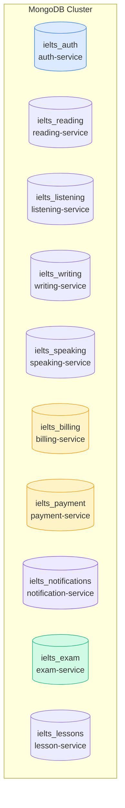
```mermaid
graph TD
    subgraph "MongoDB Cluster"
        DB1[(ielts_auth\nauth-service)]
        DB2[(ielts_reading\nreading-service)]
        DB3[(ielts_listening\nlistening-service)]
        DB4[(ielts_writing\nwriting-service)]
        DB5[(ielts_speaking\nspeaking-service)]
        DB6[(ielts_billing\nbilling-service)]
        DB7[(ielts_payment\npayment-service)]
        DB8[(ielts_notifications\nnotification-service)]
        DB9[(ielts_exam\nexam-service)]
        DB10[(ielts_lessons\nlesson-service)]
    end
    style DB1 fill:#dbeafe,stroke:#3b82f6
    style DB6 fill:#fef3c7,stroke:#f59e0b
    style DB7 fill:#fef3c7,stroke:#f59e0b
    style DB9 fill:#d1fae5,stroke:#10b981
    style DB8 fill:#ede9fe,stroke:#8b5cf6
```

---

## 1. `ielts_auth` — Identity Domain

### 1.1 Collection: `users`

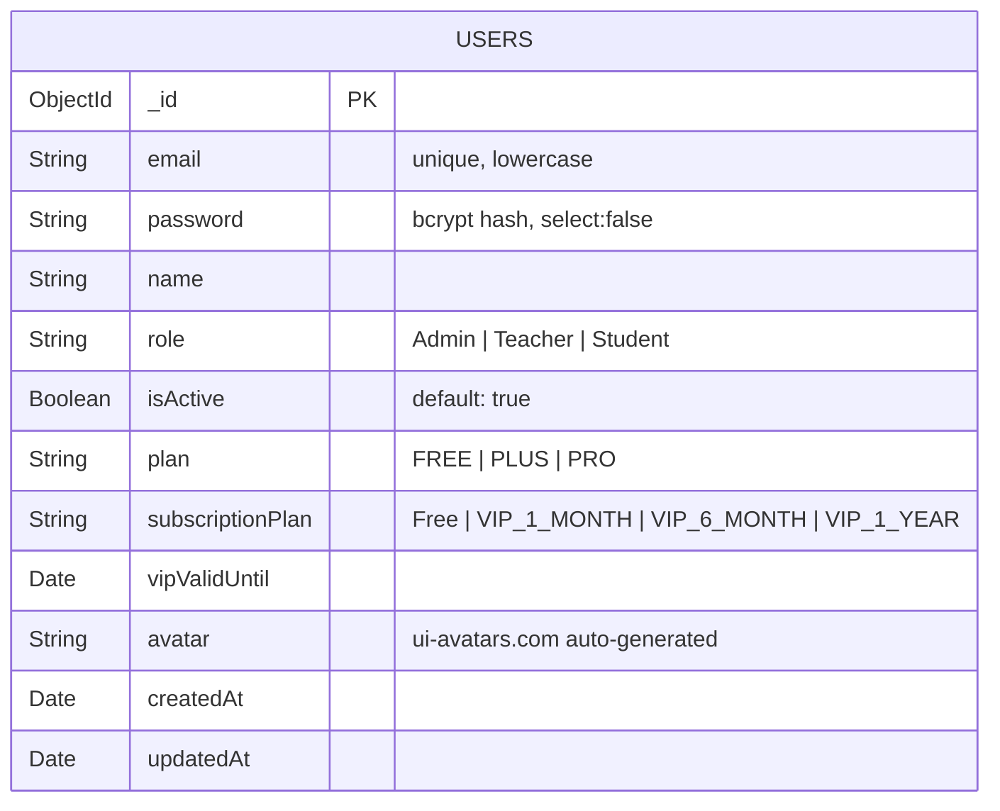
```mermaid
erDiagram
    USERS {
        ObjectId _id PK
        String email "unique, lowercase"
        String password "bcrypt hash, select:false"
        String name
        String role "Admin | Teacher | Student"
        Boolean isActive "default: true"
        String plan "FREE | PLUS | PRO"
        String subscriptionPlan "Free | VIP_1_MONTH | VIP_6_MONTH | VIP_1_YEAR"
        Date vipValidUntil
        String avatar "ui-avatars.com auto-generated"
        Date createdAt
        Date updatedAt
    }
```

**Index:** `email` (unique)  
**Method:** `matchPassword(enteredPassword)` → bcrypt.compare  
**Pre-save hook:** bcrypt hash mật khẩu với saltRounds = 10

---

### 1.2 Collection: `systemconfigs`

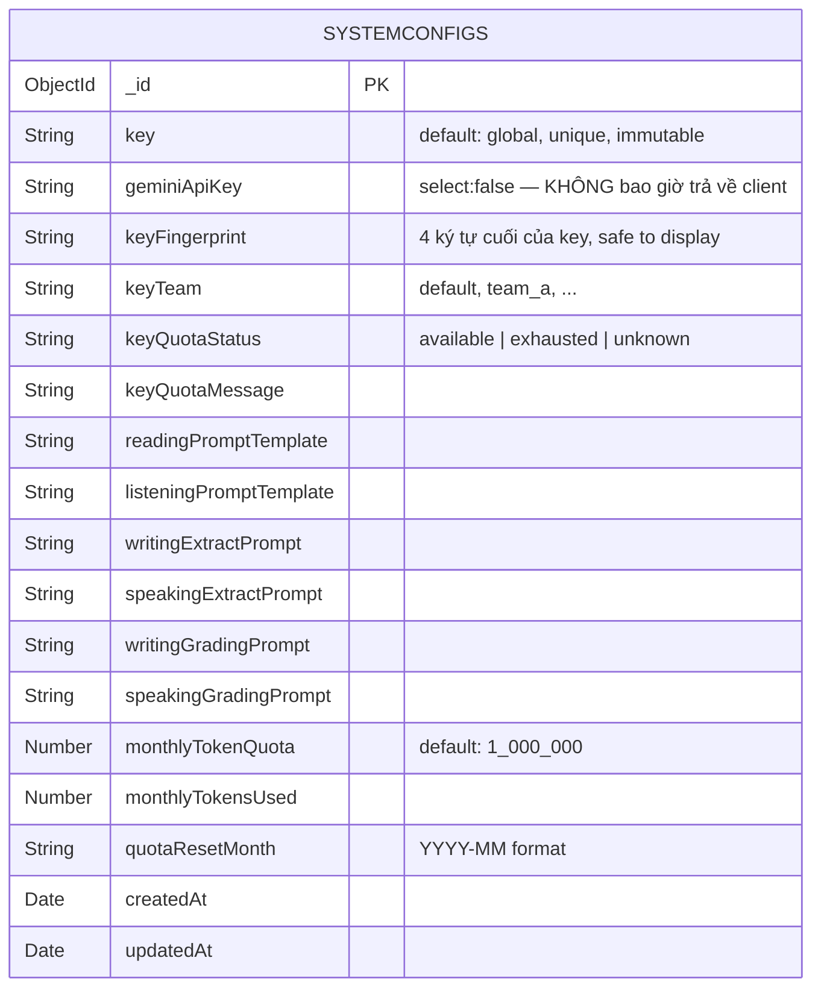
```mermaid
erDiagram
    SYSTEMCONFIGS {
        ObjectId _id PK
        String key "default: global, unique, immutable"
        String geminiApiKey "select:false — KHÔNG bao giờ trả về client"
        String keyFingerprint "4 ký tự cuối của key, safe to display"
        String keyTeam "default, team_a, ..."
        String keyQuotaStatus "available | exhausted | unknown"
        String keyQuotaMessage
        String readingPromptTemplate
        String listeningPromptTemplate
        String writingExtractPrompt
        String speakingExtractPrompt
        String writingGradingPrompt
        String speakingGradingPrompt
        Number monthlyTokenQuota "default: 1_000_000"
        Number monthlyTokensUsed
        String quotaResetMonth "YYYY-MM format"
        Date createdAt
        Date updatedAt
    }
```

---

## 2. `ielts_reading` — Reading Domain

### Collection: `readingtests`

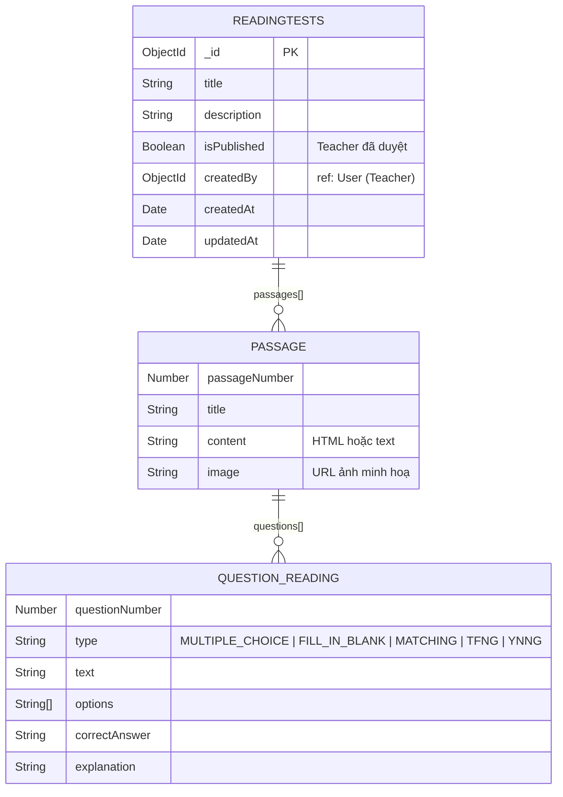
```mermaid
erDiagram
    READINGTESTS {
        ObjectId _id PK
        String title
        String description
        Boolean isPublished "Teacher đã duyệt"
        ObjectId createdBy "ref: User (Teacher)"
        Date createdAt
        Date updatedAt
    }

    PASSAGE {
        Number passageNumber
        String title
        String content "HTML hoặc text"
        String image "URL ảnh minh hoạ"
    }

    QUESTION_READING {
        Number questionNumber
        String type "MULTIPLE_CHOICE | FILL_IN_BLANK | MATCHING | TFNG | YNNG"
        String text
        String[] options
        String correctAnswer
        String explanation
    }

    READINGTESTS ||--o{ PASSAGE : "passages[]"
    PASSAGE ||--o{ QUESTION_READING : "questions[]"
```

### Collection: `readingattempts` (Model: `ReadingAttempt`)

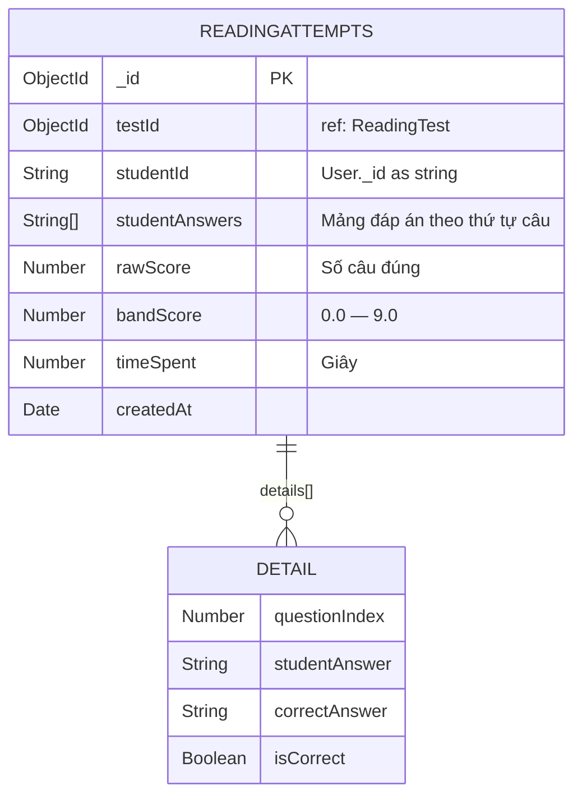
```mermaid
erDiagram
    READINGATTEMPTS {
        ObjectId _id PK
        ObjectId testId "ref: ReadingTest"
        String studentId "User._id as string"
        String[] studentAnswers "Mảng đáp án theo thứ tự câu"
        Number rawScore "Số câu đúng"
        Number bandScore "0.0 — 9.0"
        Number timeSpent "Giây"
        Date createdAt
    }

    DETAIL {
        Number questionIndex
        String studentAnswer
        String correctAnswer
        Boolean isCorrect
    }

    READINGATTEMPTS ||--o{ DETAIL : "details[]"
```

---

## 3. `ielts_listening` — Listening Domain

### Collection: `listeningtests`

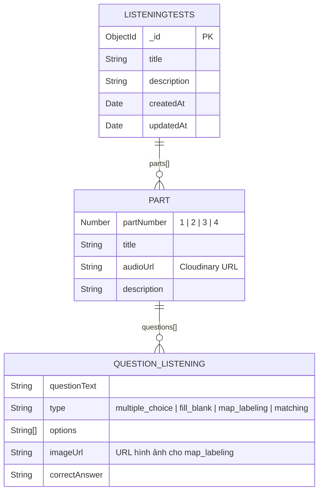
```mermaid
erDiagram
    LISTENINGTESTS {
        ObjectId _id PK
        String title
        String description
        Date createdAt
        Date updatedAt
    }

    PART {
        Number partNumber "1 | 2 | 3 | 4"
        String title
        String audioUrl "Cloudinary URL"
        String description
    }

    QUESTION_LISTENING {
        String questionText
        String type "multiple_choice | fill_blank | map_labeling | matching"
        String[] options
        String imageUrl "URL hình ảnh cho map_labeling"
        String correctAnswer
    }

    LISTENINGTESTS ||--o{ PART : "parts[]"
    PART ||--o{ QUESTION_LISTENING : "questions[]"
```

---

## 4. `ielts_writing` — Writing Domain

### Collection: `writingtests`

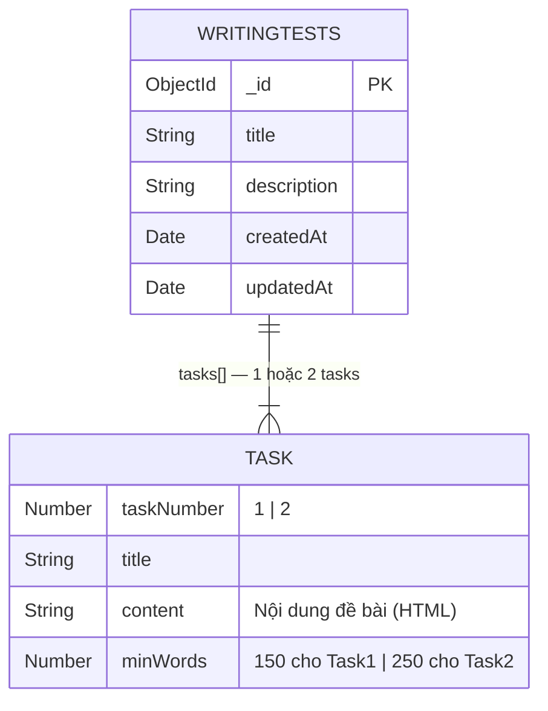
```mermaid
erDiagram
    WRITINGTESTS {
        ObjectId _id PK
        String title
        String description
        Date createdAt
        Date updatedAt
    }

    TASK {
        Number taskNumber "1 | 2"
        String title
        String content "Nội dung đề bài (HTML)"
        Number minWords "150 cho Task1 | 250 cho Task2"
    }

    WRITINGTESTS ||--|{ TASK : "tasks[] — 1 hoặc 2 tasks"
```

### Collection: `writingsubmissions` (Model: `WritingSubmission`)

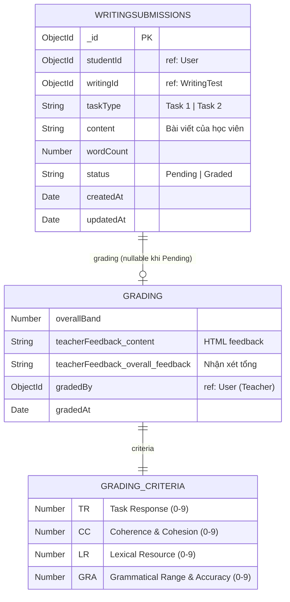
```mermaid
erDiagram
    WRITINGSUBMISSIONS {
        ObjectId _id PK
        ObjectId studentId "ref: User"
        ObjectId writingId "ref: WritingTest"
        String taskType "Task 1 | Task 2"
        String content "Bài viết của học viên"
        Number wordCount
        String status "Pending | Graded"
        Date createdAt
        Date updatedAt
    }

    GRADING_CRITERIA {
        Number TR "Task Response (0-9)"
        Number CC "Coherence & Cohesion (0-9)"
        Number LR "Lexical Resource (0-9)"
        Number GRA "Grammatical Range & Accuracy (0-9)"
    }

    GRADING {
        Number overallBand
        String teacherFeedback_content "HTML feedback"
        String teacherFeedback_overall_feedback "Nhận xét tổng"
        ObjectId gradedBy "ref: User (Teacher)"
        Date gradedAt
    }

    WRITINGSUBMISSIONS ||--o| GRADING : "grading (nullable khi Pending)"
    GRADING ||--|| GRADING_CRITERIA : "criteria"
```

---

## 5. `ielts_speaking` — Speaking Domain

### Collection: `speakingtests`

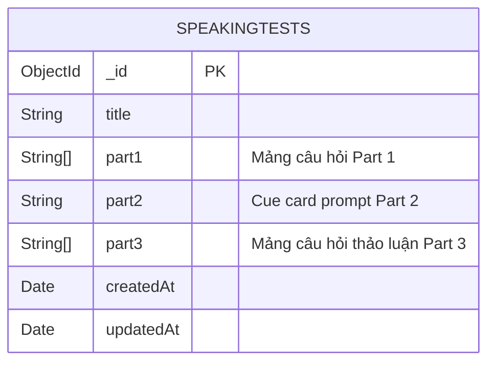
```mermaid
erDiagram
    SPEAKINGTESTS {
        ObjectId _id PK
        String title
        String[] part1 "Mảng câu hỏi Part 1"
        String part2 "Cue card prompt Part 2"
        String[] part3 "Mảng câu hỏi thảo luận Part 3"
        Date createdAt
        Date updatedAt
    }
```

### Collection: `speakingsubmissions`

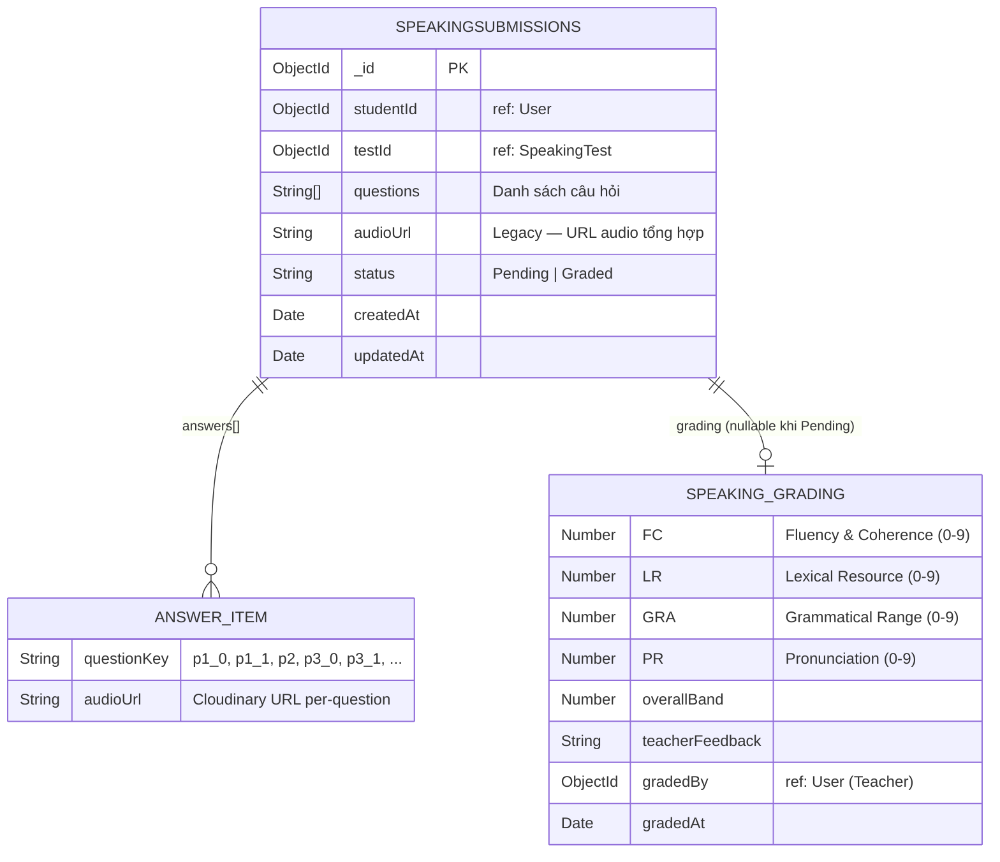
```mermaid
erDiagram
    SPEAKINGSUBMISSIONS {
        ObjectId _id PK
        ObjectId studentId "ref: User"
        ObjectId testId "ref: SpeakingTest"
        String[] questions "Danh sách câu hỏi"
        String audioUrl "Legacy — URL audio tổng hợp"
        String status "Pending | Graded"
        Date createdAt
        Date updatedAt
    }

    ANSWER_ITEM {
        String questionKey "p1_0, p1_1, p2, p3_0, p3_1, ..."
        String audioUrl "Cloudinary URL per-question"
    }

    SPEAKING_GRADING {
        Number FC "Fluency & Coherence (0-9)"
        Number LR "Lexical Resource (0-9)"
        Number GRA "Grammatical Range (0-9)"
        Number PR "Pronunciation (0-9)"
        Number overallBand
        String teacherFeedback
        ObjectId gradedBy "ref: User (Teacher)"
        Date gradedAt
    }

    SPEAKINGSUBMISSIONS ||--o{ ANSWER_ITEM : "answers[]"
    SPEAKINGSUBMISSIONS ||--o| SPEAKING_GRADING : "grading (nullable khi Pending)"
```

---

## 6. `ielts_billing` — Billing Domain

### Collection: `plans`

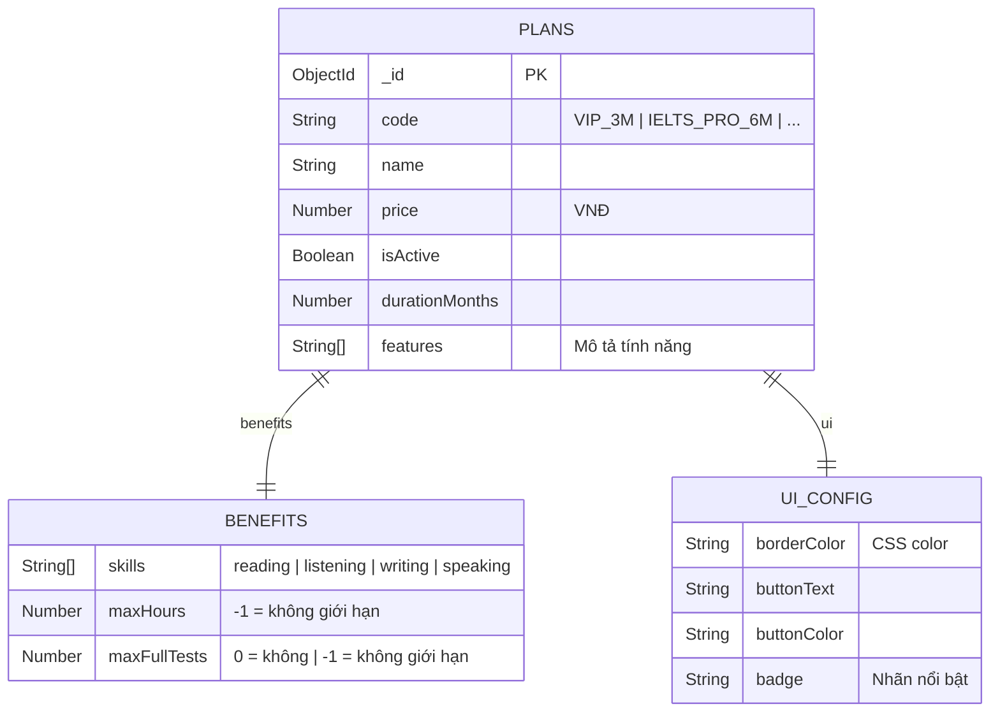
```mermaid
erDiagram
    PLANS {
        ObjectId _id PK
        String code "VIP_3M | IELTS_PRO_6M | ..."
        String name
        Number price "VNĐ"
        Boolean isActive
        Number durationMonths
        String[] features "Mô tả tính năng"
    }

    BENEFITS {
        String[] skills "reading | listening | writing | speaking"
        Number maxHours "-1 = không giới hạn"
        Number maxFullTests "0 = không | -1 = không giới hạn"
    }

    UI_CONFIG {
        String borderColor "CSS color"
        String buttonText
        String buttonColor
        String badge "Nhãn nổi bật"
    }

    PLANS ||--|| BENEFITS : "benefits"
    PLANS ||--|| UI_CONFIG : "ui"
```

### Collection: `subscriptions`

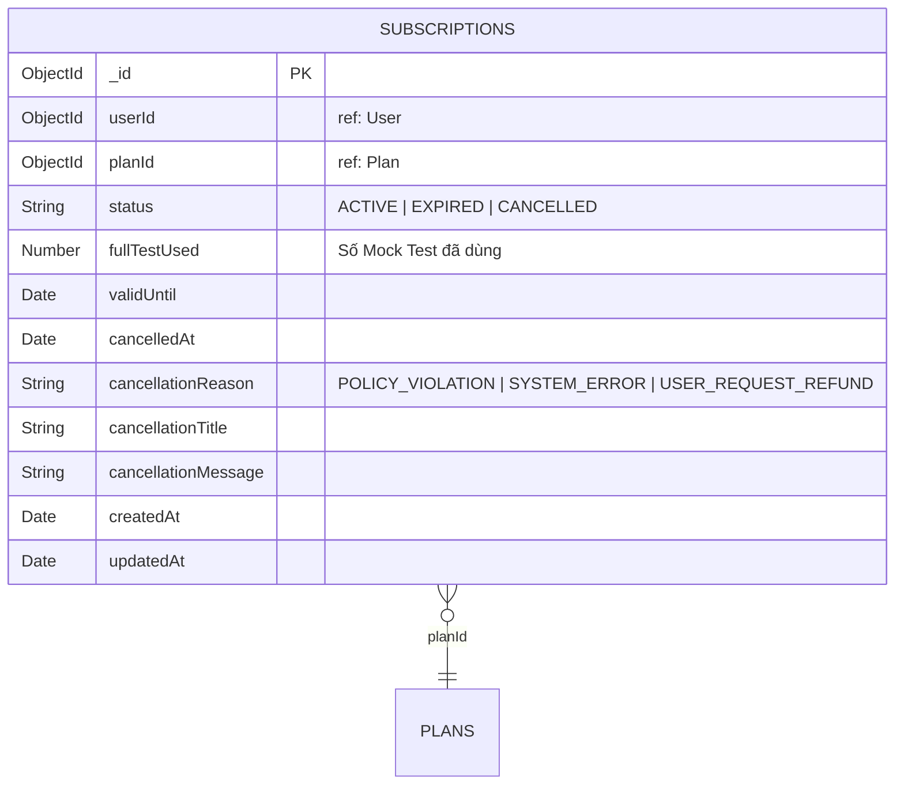
```mermaid
erDiagram
    SUBSCRIPTIONS {
        ObjectId _id PK
        ObjectId userId "ref: User"
        ObjectId planId "ref: Plan"
        String status "ACTIVE | EXPIRED | CANCELLED"
        Number fullTestUsed "Số Mock Test đã dùng"
        Date validUntil
        Date cancelledAt
        String cancellationReason "POLICY_VIOLATION | SYSTEM_ERROR | USER_REQUEST_REFUND"
        String cancellationTitle
        String cancellationMessage
        Date createdAt
        Date updatedAt
    }

    SUBSCRIPTIONS }o--|| PLANS : "planId"
```

---

## 7. `ielts_payment` — Payment Domain

### Collection: `transactions`

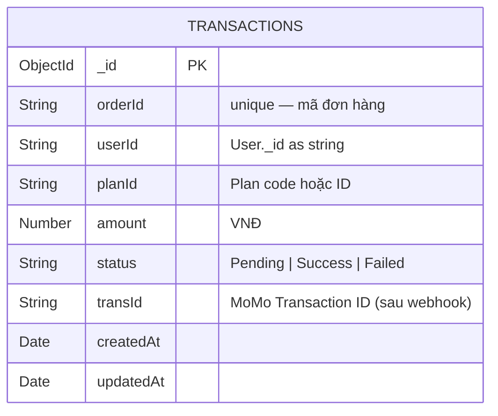
```mermaid
erDiagram
    TRANSACTIONS {
        ObjectId _id PK
        String orderId "unique — mã đơn hàng"
        String userId "User._id as string"
        String planId "Plan code hoặc ID"
        Number amount "VNĐ"
        String status "Pending | Success | Failed"
        String transId "MoMo Transaction ID (sau webhook)"
        Date createdAt
        Date updatedAt
    }
```

**Index:** `orderId` (unique)

---

## 8. `ielts_notifications` — Notification Domain

### Collection: `notificationlogs`

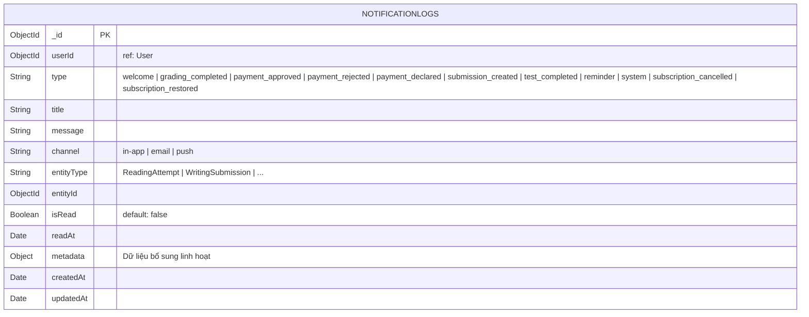
```mermaid
erDiagram
    NOTIFICATIONLOGS {
        ObjectId _id PK
        ObjectId userId "ref: User"
        String type "welcome | grading_completed | payment_approved | payment_rejected | payment_declared | submission_created | test_completed | reminder | system | subscription_cancelled | subscription_restored"
        String title
        String message
        String channel "in-app | email | push"
        String entityType "ReadingAttempt | WritingSubmission | ..."
        ObjectId entityId
        Boolean isRead "default: false"
        Date readAt
        Object metadata "Dữ liệu bổ sung linh hoạt"
        Date createdAt
        Date updatedAt
    }
```

**Compound Index:** `{ userId: 1, isRead: 1, createdAt: -1 }` — Tối ưu query "thông báo chưa đọc của user X sắp xếp mới nhất trước"

---

## 9. `ielts_exam` — Exam Orchestration Domain

### Collection: `exams`

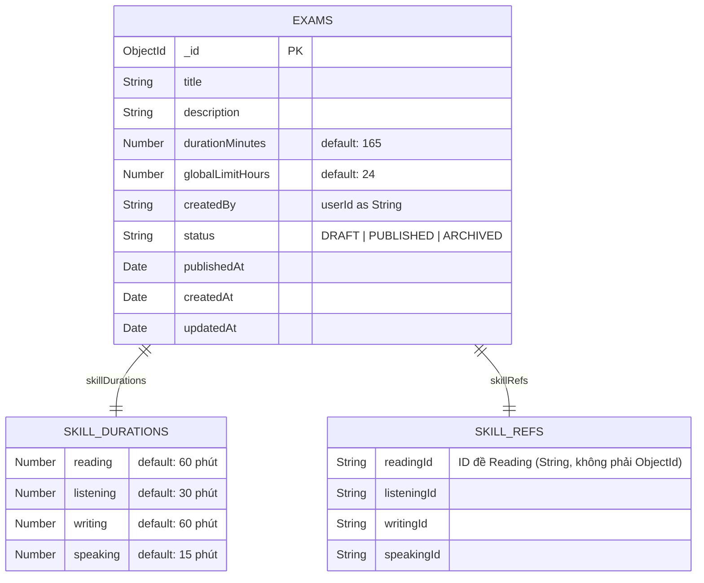
```mermaid
erDiagram
    EXAMS {
        ObjectId _id PK
        String title
        String description
        Number durationMinutes "default: 165"
        Number globalLimitHours "default: 24"
        String createdBy "userId as String"
        String status "DRAFT | PUBLISHED | ARCHIVED"
        Date publishedAt
        Date createdAt
        Date updatedAt
    }

    SKILL_DURATIONS {
        Number reading "default: 60 phút"
        Number listening "default: 30 phút"
        Number writing "default: 60 phút"
        Number speaking "default: 15 phút"
    }

    SKILL_REFS {
        String readingId "ID đề Reading (String, không phải ObjectId)"
        String listeningId
        String writingId
        String speakingId
    }

    EXAMS ||--|| SKILL_DURATIONS : "skillDurations"
    EXAMS ||--|| SKILL_REFS : "skillRefs"
```

### Collection: `examattempts`

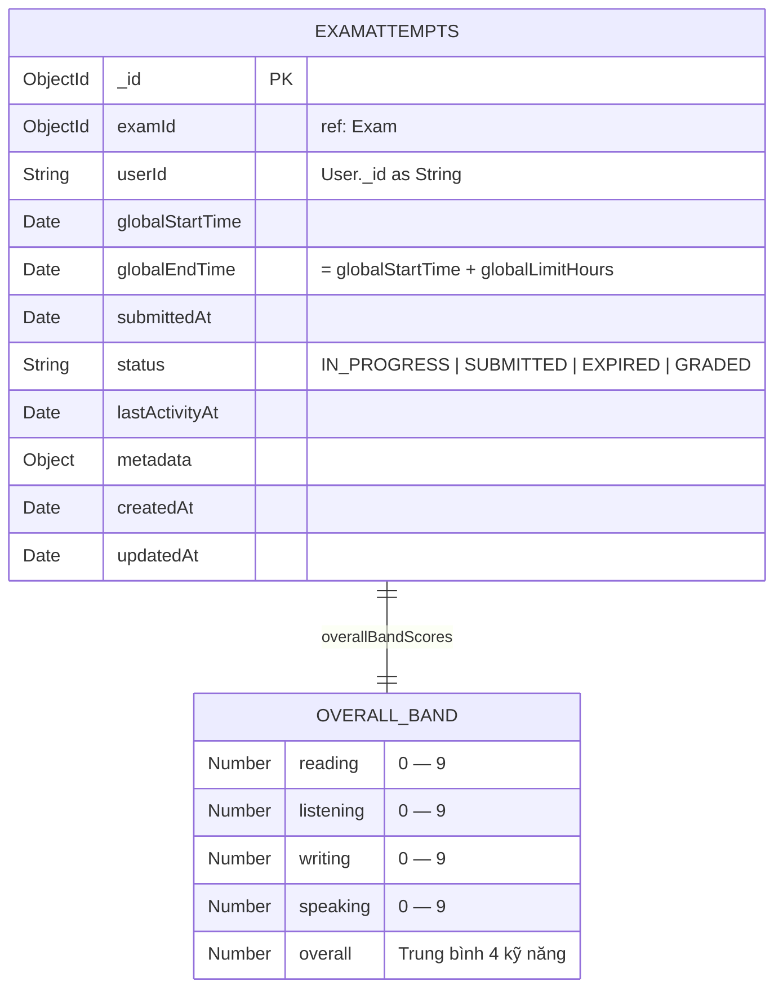
```mermaid
erDiagram
    EXAMATTEMPTS {
        ObjectId _id PK
        ObjectId examId "ref: Exam"
        String userId "User._id as String"
        Date globalStartTime
        Date globalEndTime "= globalStartTime + globalLimitHours"
        Date submittedAt
        String status "IN_PROGRESS | SUBMITTED | EXPIRED | GRADED"
        Date lastActivityAt
        Object metadata
        Date createdAt
        Date updatedAt
    }

    OVERALL_BAND {
        Number reading "0 — 9"
        Number listening "0 — 9"
        Number writing "0 — 9"
        Number speaking "0 — 9"
        Number overall "Trung bình 4 kỹ năng"
    }

    EXAMATTEMPTS ||--|| OVERALL_BAND : "overallBandScores"
```

### Collection: `skillattempts`

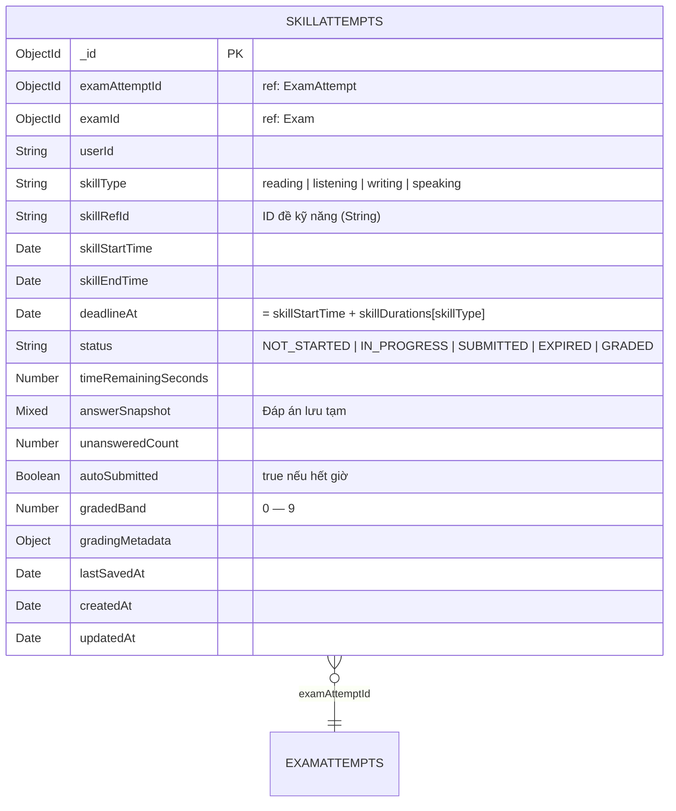
```mermaid
erDiagram
    SKILLATTEMPTS {
        ObjectId _id PK
        ObjectId examAttemptId "ref: ExamAttempt"
        ObjectId examId "ref: Exam"
        String userId
        String skillType "reading | listening | writing | speaking"
        String skillRefId "ID đề kỹ năng (String)"
        Date skillStartTime
        Date skillEndTime
        Date deadlineAt "= skillStartTime + skillDurations[skillType]"
        String status "NOT_STARTED | IN_PROGRESS | SUBMITTED | EXPIRED | GRADED"
        Number timeRemainingSeconds
        Mixed answerSnapshot "Đáp án lưu tạm"
        Number unansweredCount
        Boolean autoSubmitted "true nếu hết giờ"
        Number gradedBand "0 — 9"
        Object gradingMetadata
        Date lastSavedAt
        Date createdAt
        Date updatedAt
    }

    SKILLATTEMPTS }o--|| EXAMATTEMPTS : "examAttemptId"
```

**Unique Compound Index:** `{ examAttemptId: 1, skillType: 1 }` — Đảm bảo mỗi lần thi chỉ có **1 SkillAttempt per kỹ năng**.

---

## 10. Sơ đồ Quan hệ Liên Service (Cross-Service References)

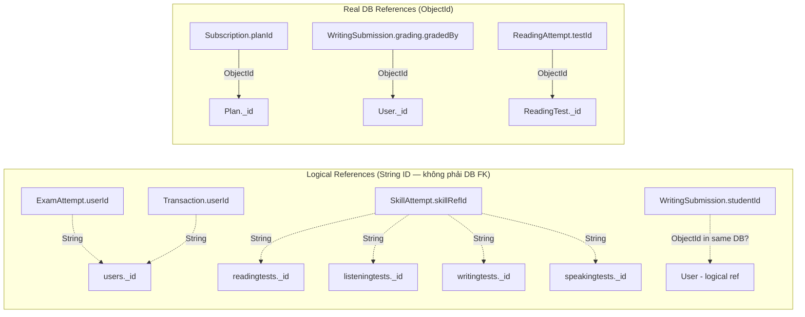
```mermaid
graph LR
    subgraph "Logical References (String ID — không phải DB FK)"
        EA[ExamAttempt.userId] -.->|String| U[users._id]
        SA[SkillAttempt.skillRefId] -.->|String| RT[readingtests._id]
        SA -.->|String| LT[listeningtests._id]
        SA -.->|String| WT[writingtests._id]
        SA -.->|String| ST[speakingtests._id]
        TX[Transaction.userId] -.->|String| U
        WS[WritingSubmission.studentId] -.->|ObjectId in same DB?| U2[User - logical ref]
    end

    subgraph "Real DB References (ObjectId)"
        SUB[Subscription.planId] -->|ObjectId| PLAN[Plan._id]
        WS2[WritingSubmission.grading.gradedBy] -->|ObjectId| U3[User._id]
        RA[ReadingAttempt.testId] -->|ObjectId| RTEST[ReadingTest._id]
    end
```

> **Nguyên tắc cốt lõi:** Các reference giữa service khác nhau luôn là **String** (loose coupling). Chỉ dùng `ObjectId ref` trong **cùng một database**.
