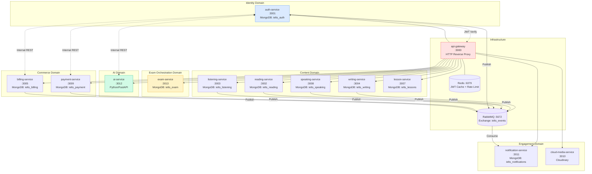
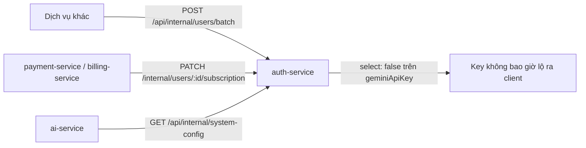
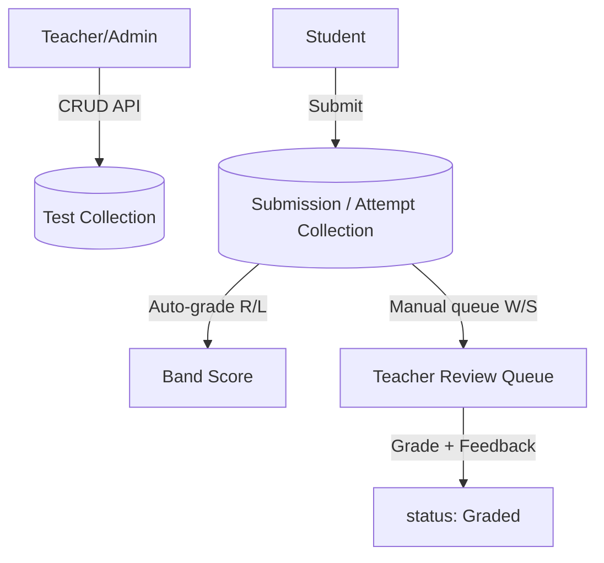
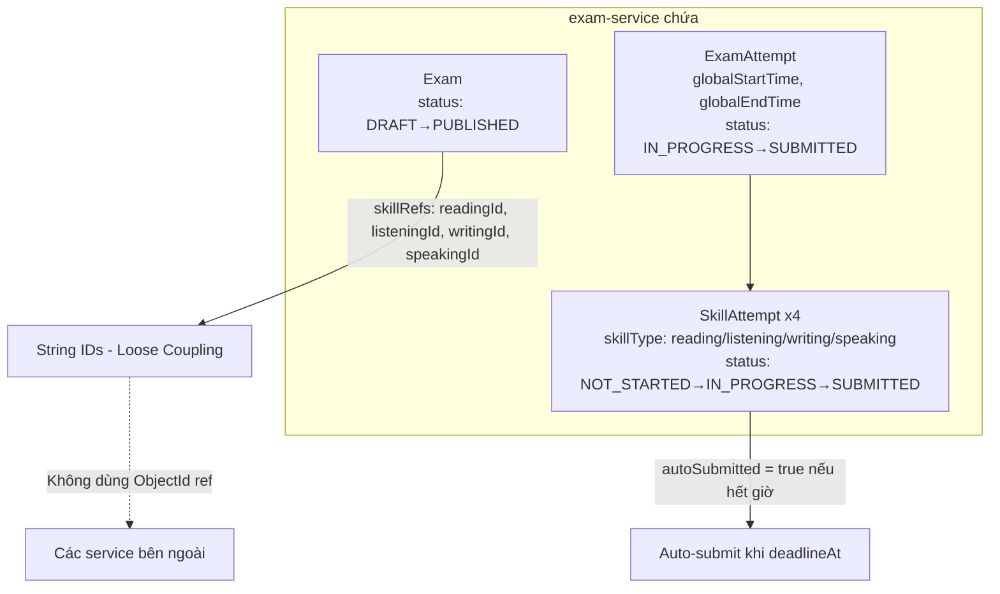
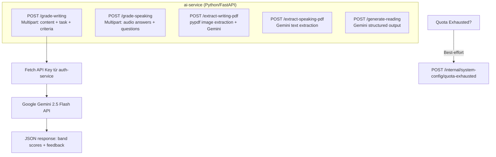
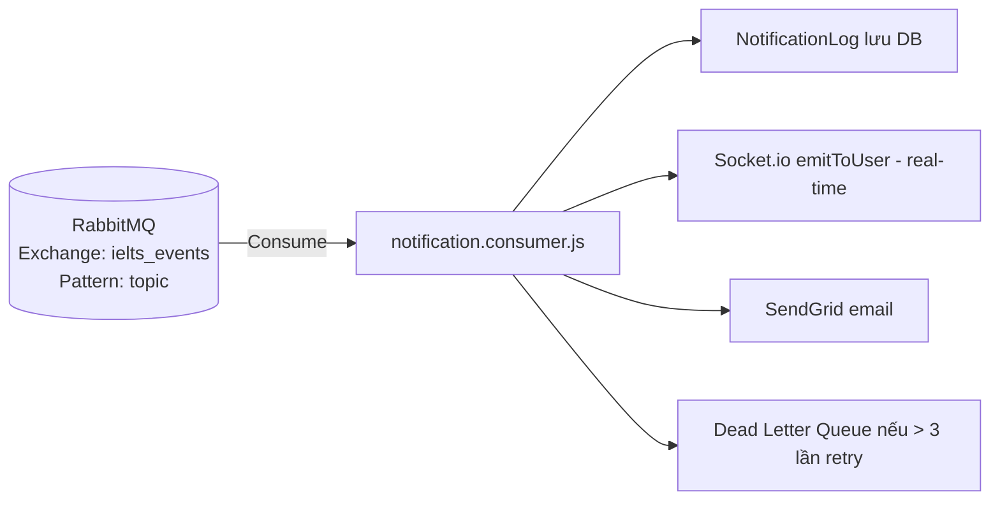
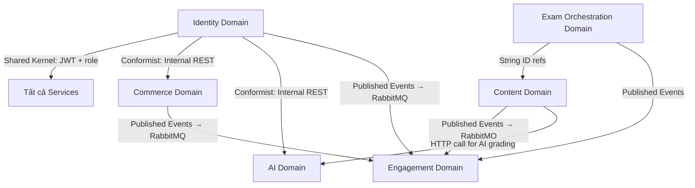
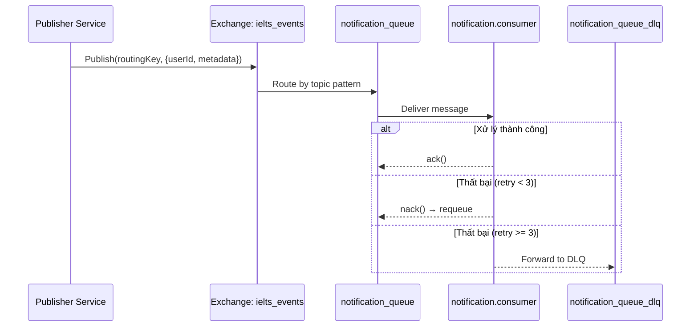

# Thiết kế Domain & Service
## Nền tảng Luyện thi IELTS — Domain-Driven Design

> **Phiên bản:** 1.0 · **Kiến trúc:** Microservices · Bounded Context per Service  
> **Pattern:** Database-per-Service · Event-Driven (RabbitMQ) · Internal REST

---

## 1. Bản đồ Bounded Context



---

## 2. Phân tích từng Bounded Context

### 2.1 Identity Domain — `auth-service`

**Trách nhiệm chính:**
- Quản lý vòng đời người dùng (đăng ký, đăng nhập, phân quyền)
- Phát hành & xác thực JWT
- Lưu trữ thông tin subscription VIP (`vipValidUntil`, `subscriptionPlan`)
- Lưu `SystemConfig` toàn cục (Gemini API Key, prompt templates)

**Cơ chế liên dịch vụ:**


| Internal Endpoint | Caller | Mục đích |
|:-----------------|:-------|:---------|
| `POST /internal/users/batch` | notification, billing | Lấy thông tin nhiều user theo IDs |
| `PATCH /internal/users/:id/subscription` | payment, billing | Cập nhật VIP sau thanh toán |
| `GET /api/internal/system-config` | ai-service | Lấy Gemini API Key + prompts |
| `POST /api/internal/system-config/quota-exhausted` | ai-service | Báo hết quota token |

---

### 2.2 Content Domain — 4 Skill Services

**Pattern chung** cho cả 4 service (reading, listening, writing, speaking):



| Service | Auto-grade? | Submission Model | Grading Criteria |
|:--------|:-----------|:-----------------|:-----------------|
| reading-service | ✅ Tức thì | `ReadingAttempt` | rawScore → bandScore |
| listening-service | ✅ Tức thì | `ListeningAttempt` | rawScore → bandScore |
| writing-service | ❌ Manual | `WritingSubmission` | TR + CC + LR + GRA (0–9 each) |
| speaking-service | ❌ Manual | `SpeakingSubmission` | FC + LR + GRA + PR (0–9 each) |

---

### 2.3 Exam Orchestration Domain — `exam-service`

**Đây là Orchestrator trung tâm** — quản lý toàn bộ luồng Mock Test 4 kỹ năng.



**Lý do dùng String ID (không phải ObjectId ref):**
> Exam-service **không import model từ service khác** — dùng String để giữ loose coupling giữa các bounded context.

---

### 2.4 Commerce Domain

```mermaid
graph TD
    subgraph "billing-service"
        PLAN[Plan\ncode, price, durationMonths\nbenefits: skills[], maxFullTests]
        SUB[Subscription\nuserId, planId, status\nvalidUntil, cancellationReason]
    end

    subgraph "payment-service"
        TX[Transaction\norderId, userId, amount VND\nstatus: Pending→Success/Failed\ntransId: MoMo txn ID]
    end

    PLAN --> SUB
    TX -->|Admin approve| SUB
    SUB -->|PATCH /internal/users/:id/subscription| AUTH[auth-service\ncập nhật vipValidUntil]
```

**Gating access dựa trên Plan:**
- `plan.benefits.skills` → Array các kỹ năng được phép truy cập.
- `plan.benefits.maxFullTests = -1` → Không giới hạn Mock Test.
- `plan.benefits.maxFullTests = 0` → Không được làm Mock Test.

---

### 2.5 AI Domain — `ai-service`



---

### 2.6 Engagement Domain

**notification-service:**


**Binding keys đang subscribe:**

| Routing Key | Trigger |
|:-----------|:--------|
| `auth.user.registered` | Gửi email chào mừng + in-app |
| `writing.submission.created` | Báo Teacher có bài chờ |
| `writing.grading.completed` | Báo Student bài đã chấm |
| `speaking.submission.created` | Báo Teacher có bài Speaking |
| `speaking.grading.completed` | Báo Student Speaking đã chấm |
| `payment.transaction.approved` | VIP kích hoạt thành công |
| `payment.transaction.rejected` | Thanh toán bị từ chối |
| `payment.transaction.declared` | Học viên đã khai báo thanh toán |
| `reading.test.completed` | Hoàn thành Reading |
| `listening.test.completed` | Hoàn thành Listening |
| `billing.subscription.*` | Huỷ hoặc khôi phục VIP |

---

## 3. Context Map — Quan hệ giữa các Domain



| Quan hệ | Pattern | Mô tả |
|:--------|:--------|:------|
| Content → Engagement | **Published Language** | Publish RabbitMQ events chuẩn hoá |
| Commerce → Identity | **Conformist** | Tuân theo API internal của auth-service |
| Exam → Content | **Anticorruption Layer** | Dùng String ID thay ObjectId để cách ly |
| All → Identity | **Shared Kernel** | JWT schema và role enum dùng chung |

---

## 4. API Gateway — Routing Table

| Path Prefix | Upstream Service | Port |
|:-----------|:-----------------|:-----|
| `/api/auth` | auth-service | 3001 |
| `/api/users` | auth-service | 3001 |
| `/api/reading` | reading-service | 3002 |
| `/api/listening` | listening-service | 3003 |
| `/api/writing` | writing-service | 3004 |
| `/api/billing` | billing-service | 3005 |
| `/api/lessons` | lesson-service | 3007 |
| `/api/speaking` | speaking-service | 3008 |
| `/api/payment` | payment-service | 3009 |
| `/api/media` | cloud-media-service | 3010 |
| `/api/notifications` | notification-service | 3011 |
| `/api/ai` | ai-service | 3012 |
| `/api/exam` | exam-service | 3013 |

**Redis tại API Gateway:**
- `JWT Blacklist` — lưu token đã logout
- `Rate Limiting` — chống brute force login

---

## 5. Event Schema — RabbitMQ

**Exchange:** `ielts_events` (type: `topic`, durable: true)  
**Dead Letter Exchange:** `ielts_events_dlx` (type: `fanout`)  
**Max Retries:** 3 lần trước khi vào DLQ


