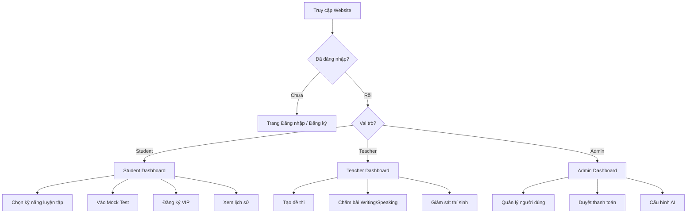
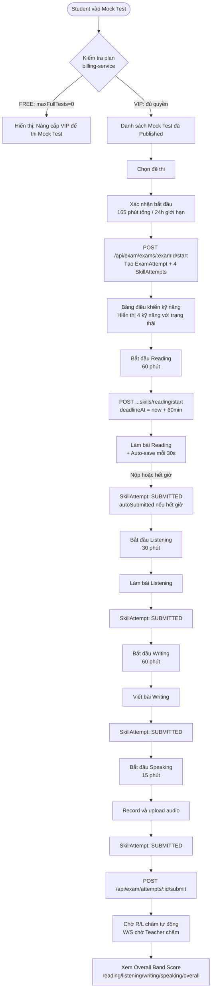
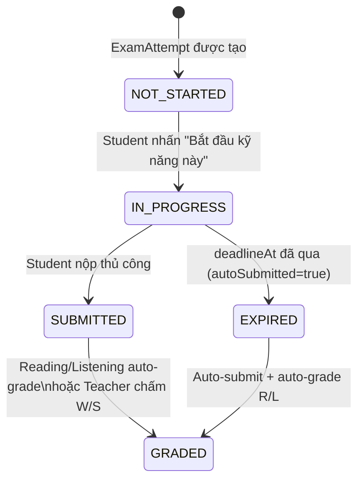
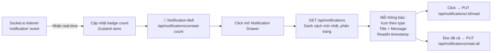

# Luồng Trải nghiệm Người dùng (UX Flow)
## Nền tảng Luyện thi IELTS — User Experience Design

> **Phiên bản:** 1.0 · **Công cụ FE:** React 19 + Vite + Zustand 5 + React Router 7  
> **Mô tả:** Tất cả luồng dựa trực tiếp trên source code và logic nghiệp vụ thực tế

---

## 1. Bản đồ Luồng Tổng quan



---

## 2. Luồng Onboarding — Đăng ký & Đăng nhập

```mermaid
flowchart TD
    A([Khách vào trang]) --> B[Trang Landing Page]
    B --> C{Hành động}
    C -->|Đăng ký mới| REG[Form Đăng ký\nemail + password + name]
    C -->|Đã có tài khoản| LGN[Form Đăng nhập]

    REG --> RV{Validation\nZod Schema}
    RV -->|Lỗi| REG_ERR[Hiển thị lỗi inline]
    RV -->|OK| POST[POST /api/auth/register]
    POST -->|201 Created| JWT_STORE[Zustand: lưu token + user]
    JWT_STORE --> WELCOME[Nhận thông báo chào mừng\nvia Socket.io]
    WELCOME --> STUDENT_HOME[Student Dashboard]

    LGN --> LV{Validation}
    LV -->|OK| POST_L[POST /api/auth/login]
    POST_L -->|401 Unauthorized| ERR[Hiển thị lỗi: Sai mật khẩu]
    POST_L -->|403 isActive=false| LOCKED[Hiển thị: Tài khoản bị khoá]
    POST_L -->|200 OK| DECODE[Decode JWT → {userId, role, plan}]
    DECODE --> ROUTE{Routing theo role}
    ROUTE -->|Student| STUDENT_HOME
    ROUTE -->|Teacher| TEACHER_HOME[Teacher Dashboard]
    ROUTE -->|Admin| ADMIN_HOME[Admin Dashboard]
```

---

## 3. Luồng Student — Luyện tập Đơn kỹ năng

### 3.1 Reading Practice

```mermaid
flowchart TD
    START([Student vào Reading]) --> LIST[Xem danh sách đề\nGET /api/reading - Public]
    LIST --> SELECT[Chọn đề thi]
    SELECT --> VIEW[Xem 3 Passage + câu hỏi]
    VIEW --> ANSWER[Trả lời từng câu\nMULTIPLE_CHOICE / FILL_IN_BLANK\nMATCHING / TFNG / YNNG]
    ANSWER --> TIMER[Đồng hồ đếm ngược\nClient-side timer]
    TIMER --> SUBMIT[POST /api/reading/:id/submit\n{studentAnswers: []}]
    SUBMIT --> RESULT[Nhận kết quả ngay\n{bandScore, details[isCorrect]}]
    RESULT --> REVIEW[Xem đáp án chi tiết\nvà giải thích]
    REVIEW --> NEXT{Tiếp theo?}
    NEXT -->|Làm bài khác| LIST
    NEXT -->|Về dashboard| STUDENT_HOME[Student Dashboard]
```

### 3.2 Writing Submission — Chờ Teacher chấm

```mermaid
flowchart TD
    W_START([Student vào Writing]) --> W_LIST[Xem danh sách đề Writing]
    W_LIST --> W_SELECT[Chọn đề]
    W_SELECT --> TASK{Loại Task}
    TASK -->|Task 1| WRITE1[Soạn bài tả biểu đồ/sơ đồ\nTiptap Rich Text Editor\nTối thiểu 150 từ]
    TASK -->|Task 2| WRITE2[Soạn bài luận nghị luận\nTối thiểu 250 từ]
    WRITE1 --> WORD_COUNT[Đếm số từ real-time]
    WRITE2 --> WORD_COUNT
    WORD_COUNT --> W_SUBMIT[POST /api/writing/submissions\n{writingId, taskType, content, wordCount}]
    W_SUBMIT --> PENDING[status: Pending\nThông báo: Bài đã nộp, chờ chấm]
    PENDING --> WAIT[Zustand polling hoặc\nSocket.io lắng nghe]
    WAIT -->|writing.grading.completed| NOTIF[Nhận thông báo real-time]
    NOTIF --> VIEW_RESULT[Xem điểm TR·CC·LR·GRA\nvà feedback của Teacher]
```

### 3.3 Speaking Submission — Nộp audio từng câu

```mermaid
flowchart TD
    SP_START([Student vào Speaking]) --> SP_LIST[Xem danh sách đề Speaking]
    SP_LIST --> SP_SELECT[Chọn đề]
    SP_SELECT --> SP_VIEW[Xem cấu trúc bài\nPart 1 / Part 2 / Part 3]

    SP_VIEW --> P1[Part 1: Câu hỏi thông thường\npart1: String[]\nKey: p1_0, p1_1, ...]
    P1 --> REC1[Học viên Record audio]
    REC1 --> UP1[POST /api/media/upload-audio\nNhận Cloudinary URL]

    UP1 --> P2[Part 2: Cue Card\nKey: p2]
    P2 --> REC2[Record 2 phút]
    REC2 --> UP2[Upload audio Part 2]

    UP2 --> P3[Part 3: Câu hỏi nâng cao\nKey: p3_0, p3_1, ...]
    P3 --> REC3[Record từng câu]
    REC3 --> UP3[Upload audio Part 3]

    UP3 --> SP_SUBMIT[POST /api/speaking/tests/:testId/attempt\n{answers: [{questionKey, audioUrl}]}]
    SP_SUBMIT --> SP_PENDING[status: Pending\nChờ Teacher nghe và chấm]
    SP_PENDING -->|speaking.grading.completed| SP_RESULT[Xem điểm FC·LR·GRA·PR]
```

---

## 4. Luồng Student — Mock Test Toàn phần (4 Kỹ năng)



**State machine của SkillAttempt:**



---

## 5. Luồng Student — Đăng ký VIP

```mermaid
flowchart TD
    VIP_PAGE([Trang Đăng ký VIP]) --> PLANS[GET /api/billing/plans\nHiển thị bảng gói dịch vụ]

    PLANS --> COMPARE[So sánh gói\nFREE / VIP_1_MONTH / VIP_6_MONTH / VIP_1_YEAR]

    subgraph "Gói VIP — Dựa trên Plan.benefits"
        F[FREE\nReading + Listening\nmaxFullTests=0]
        P[VIP_1_MONTH\nReading + Listening + Writing\nmaxFullTests=3]
        PR[VIP_1_YEAR\nAll 4 skills\nmaxFullTests=-1 unlimited]
    end

    COMPARE --> SELECT_PLAN[Student chọn gói]
    SELECT_PLAN --> CREATE_TX[POST /api/payment/create-transaction\n{planId, amount}]
    CREATE_TX --> QR[Nhận VietQR URL\nHiển thị mã QR chuyển khoản]
    QR --> TRANSFER[Student thực hiện chuyển khoản\nngoài hệ thống]
    TRANSFER --> DECLARE[POST /api/payment/declare/:orderId\nKhai báo đã chuyển khoản]
    DECLARE --> WAIT_ADMIN[Chờ Admin duyệt\nHiển thị: Đang xử lý...]
    WAIT_ADMIN -->|payment.transaction.approved| VIP_ACTIVE[Socket.io push:\nVIP đã kích hoạt! 🎉]
    WAIT_ADMIN -->|payment.transaction.rejected| REJECTED[Socket.io push:\nThanh toán bị từ chối]
    VIP_ACTIVE --> UPDATE_UI[Zustand cập nhật user.plan\nvà vipValidUntil]
    UPDATE_UI --> UNLOCK[Mở khoá tính năng VIP\ndựa trên plan.benefits.skills]
```

---

## 6. Luồng Teacher — Tạo đề và Chấm bài

### 6.1 Teacher tạo đề Writing

```mermaid
flowchart TD
    T_START([Teacher vào Quản lý đề thi]) --> T_SELECT{Loại đề}
    T_SELECT -->|Từ PDF| PDF_UPLOAD[Upload file PDF đề thi\nPOST /api/ai/extract-writing-pdf]
    T_SELECT -->|Nhập tay| MANUAL[Form tạo đề thủ công]
    T_SELECT -->|Mock Exam từ PDF| ORCHESTRATE[POST /api/exam/teacher/exams/orchestrate-pdf\nUpload fullExamPdf + answerKeyPdf]

    PDF_UPLOAD --> AI_PARSE[ai-service:\n1. pypdf trích xuất ảnh\n2. Gemini parse cấu trúc]
    AI_PARSE --> PREVIEW[Preview kết quả trích xuất\n{title, tasks[{taskNumber, content, minWords}]}]
    PREVIEW --> EDIT[Teacher chỉnh sửa nếu cần]
    EDIT --> SAVE[POST /api/writing\nLưu WritingTest]
    SAVE --> PUBLISH_CHECK[isPublished = true]
    PUBLISH_CHECK --> LIVE[Đề sẵn sàng cho Student]

    ORCHESTRATE --> AI_FULL[ai-service tạo cả 4 kỹ năng\nReading+Listening+Writing+Speaking]
    AI_FULL --> EXAM_DRAFT[Tạo Exam {status: DRAFT}]
    EXAM_DRAFT --> T_REVIEW[Teacher review từng kỹ năng]
    T_REVIEW --> PUBLISH[POST /api/exam/teacher/exams/:id/publish\nstatus: DRAFT → PUBLISHED]
```

### 6.2 Teacher chấm bài Writing

```mermaid
flowchart TD
    GRADE_START([Teacher vào Chấm bài]) --> QUEUE[GET /api/writing/submissions/pending\nDanh sách bài chờ chấm]
    QUEUE --> PICK[Chọn bài cần chấm]
    PICK --> VIEW_ESSAY[Đọc bài viết của Student\n+ Xem đề gốc song song]
    VIEW_ESSAY --> AI_SUGGEST{AI gợi ý điểm?}
    AI_SUGGEST -->|Có| AI_GRADE[POST /api/ai/grade-writing\nAI chấm trước → Gợi ý điểm]
    AI_GRADE --> FILL_SCORES[Teacher xem gợi ý AI\nvà điều chỉnh điểm thực tế]
    AI_SUGGEST -->|Không| FILL_SCORES

    FILL_SCORES --> INPUT[Nhập điểm:\nTR: 0-9\nCC: 0-9\nLR: 0-9\nGRA: 0-9]
    INPUT --> FEEDBACK[Viết feedback\nTiptap Editor]
    FEEDBACK --> SUBMIT_GRADE[PUT /api/writing/submissions/:id/grade\n{criteria:{TR,CC,LR,GRA}, teacherFeedback}]
    SUBMIT_GRADE --> PUBLISHED[status → Graded\nRabbitMQ: writing.grading.completed]
    PUBLISHED --> STUDENT_NOTIF[Student nhận thông báo real-time\nvia Socket.io]
    PUBLISHED --> NEXT_ITEM[Teacher chuyển sang bài tiếp theo]
```

---

## 7. Luồng Admin — Duyệt Thanh toán

```mermaid
flowchart TD
    ADMIN_PAY([Admin vào Quản lý Thanh toán]) --> TX_LIST[GET /api/payment/transactions\nDanh sách giao dịch filter by status]
    TX_LIST --> FILTER[Filter: Pending / Success / Failed]
    FILTER --> REVIEW[Xem chi tiết giao dịch\n{orderId, userId, amount, planId}]

    REVIEW --> VERIFY[Admin kiểm tra\nngoài hệ thống: ngân hàng/MoMo]
    VERIFY --> DECISION{Quyết định}

    DECISION -->|Xác nhận đúng| APPROVE[POST /api/payment/approve/:orderId]
    APPROVE --> CHAIN[1. Transaction → Success\n2. PATCH /internal/users/:id/subscription\n3. vipValidUntil = now + durationMonths\n4. Publish payment.transaction.approved]
    CHAIN --> STUDENT_VIP[Student nhận thông báo VIP kích hoạt]

    DECISION -->|Không hợp lệ| REJECT[POST /api/payment/reject/:orderId\n{reason}]
    REJECT --> CHAIN2[1. Transaction → Failed\n2. Publish payment.transaction.rejected]
    CHAIN2 --> STUDENT_REJECT[Student nhận thông báo từ chối]
```

---

## 8. Luồng Admin — Quản lý Người dùng

```mermaid
flowchart TD
    USER_MGT([Admin vào Quản lý Users]) --> U_LIST[GET /api/users\nDanh sách tất cả users\n+ tìm kiếm, filter by role/status]
    U_LIST --> U_ACTION{Thao tác}

    U_ACTION -->|Thay đổi Role| ROLE[PUT /api/users/:id/role\n{role: Admin|Teacher|Student}]
    U_ACTION -->|Khoá tài khoản| LOCK[PUT /api/users/:id/status\n{isActive: false}]
    U_ACTION -->|Mở khoá| UNLOCK2[PUT /api/users/:id/status\n{isActive: true}]
    U_ACTION -->|Xem thống kê| STATS[GET /api/users/stats\nTổng users, theo role, mới tháng này]
```

---

## 9. Luồng Admin — Cấu hình AI (SystemConfig)

```mermaid
flowchart TD
    AI_CONFIG([Admin vào Cài đặt AI]) --> VIEW_CONFIG[GET system config\nHiển thị keyFingerprint, keyQuotaStatus]

    VIEW_CONFIG --> UPDATE{Cập nhật}
    UPDATE -->|Đổi API Key| NEW_KEY[Nhập Gemini API Key mới\nLưu vào DB, select:false]
    UPDATE -->|Chỉnh Prompt| EDIT_PROMPT[Sửa writingGradingPrompt\nspeakingGradingPrompt\nwritingExtractPrompt...]
    UPDATE -->|Xem Quota| QUOTA[Xem monthlyTokensUsed / monthlyTokenQuota\nkeyQuotaStatus: available | exhausted]

    NEW_KEY --> FINGERPRINT[Hệ thống lưu keyFingerprint\n4 ký tự cuối - safe to display]
    FINGERPRINT --> AI_FETCH[ai-service tự động fetch key mới\ntrong request tiếp theo]
```

---

## 10. Màn hình Thông báo Real-time



**Các loại thông báo và icon tương ứng:**

| Type | Ngữ cảnh | Icon |
|:-----|:---------|:-----|
| `welcome` | Đăng ký mới | 🎉 |
| `grading_completed` | Bài Writing/Speaking đã chấm | ✅ |
| `payment_approved` | VIP đã kích hoạt | 💳 |
| `payment_rejected` | Thanh toán bị từ chối | ❌ |
| `payment_declared` | Chờ duyệt (Admin) | ⏳ |
| `submission_created` | Có bài mới chờ chấm (Teacher) | 📝 |
| `test_completed` | Hoàn thành Reading/Listening | 🏆 |
| `subscription_cancelled` | VIP bị huỷ | ⚠️ |
| `subscription_restored` | VIP được khôi phục | 🔄 |

---

## 11. Sơ đồ Navigation — React Router 7

```mermaid
graph TD
    ROOT["/"] --> HOME[Trang chủ / Landing]
    ROOT --> LOGIN_R["/login" — Đăng nhập]
    ROOT --> REGISTER_R["/register" — Đăng ký]

    ROOT --> PROTECTED{Protected Routes\nverifyToken}
    PROTECTED --> DASHBOARD["/dashboard" — Student Dashboard]
    PROTECTED --> READING_R["/reading" — Danh sách đề Reading]
    PROTECTED --> READING_ID["/reading/:id" — Làm bài Reading]
    PROTECTED --> LISTENING_R["/listening" — Listening"]
    PROTECTED --> WRITING_R["/writing" — Writing"]
    PROTECTED --> SPEAKING_R["/speaking" — Speaking]
    PROTECTED --> EXAM_R["/exam" — Mock Test"]
    PROTECTED --> EXAM_ATTEMPT["/exam/attempt/:id" — Đang thi"]
    PROTECTED --> BILLING_R["/billing/plans" — Gói dịch vụ]
    PROTECTED --> PROFILE_R["/profile" — Thông tin cá nhân]
    PROTECTED --> NOTIF_R["/notifications" — Thông báo]

    PROTECTED --> TEACHER_GUARD{role === Teacher\nhoặc Admin}
    TEACHER_GUARD --> T_CONTENT["/teacher/content" — Quản lý đề thi]
    TEACHER_GUARD --> T_GRADE["/teacher/grading" — Queue chấm bài]
    TEACHER_GUARD --> T_MONITOR["/teacher/monitoring" — Giám sát Mock Test]

    PROTECTED --> ADMIN_GUARD{role === Admin}
    ADMIN_GUARD --> A_USERS["/admin/users" — Quản lý users]
    ADMIN_GUARD --> A_PAYMENT["/admin/payments" — Duyệt thanh toán]
    ADMIN_GUARD --> A_AI["/admin/ai-config" — Cấu hình AI]
```
