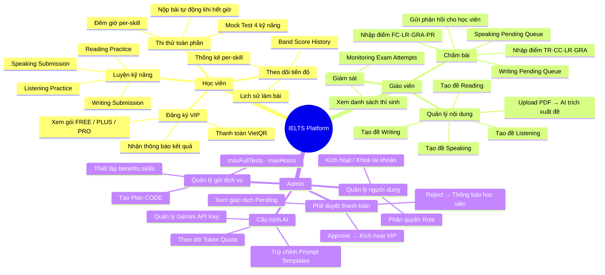
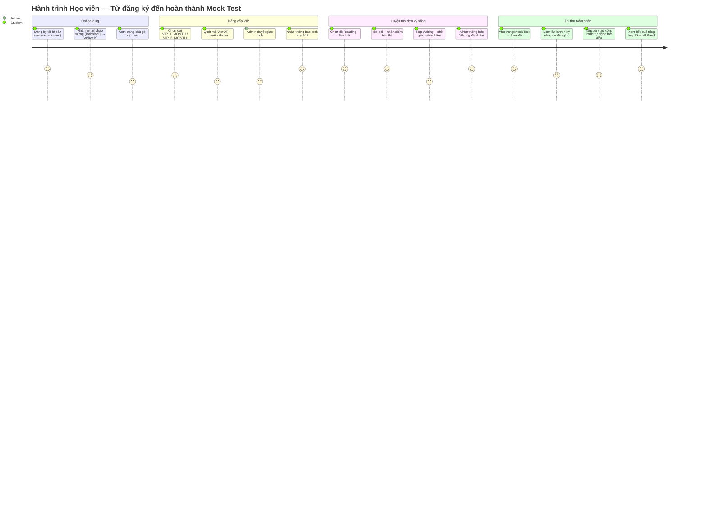
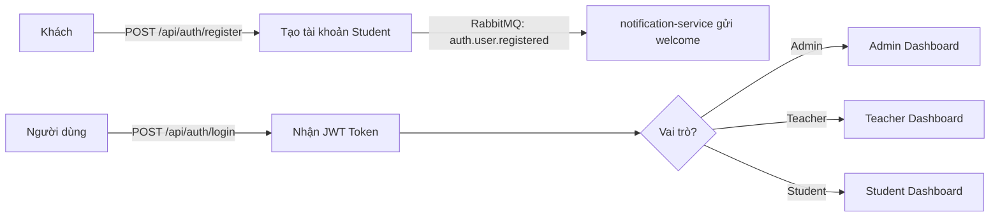
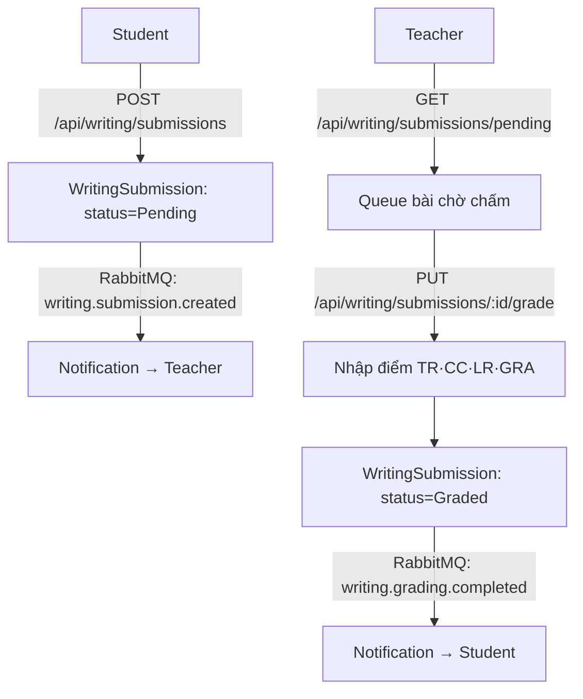
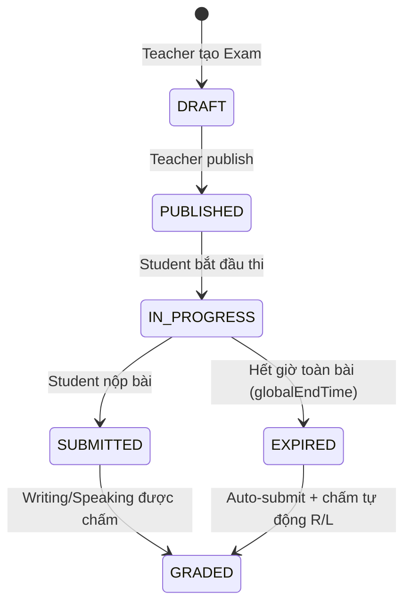
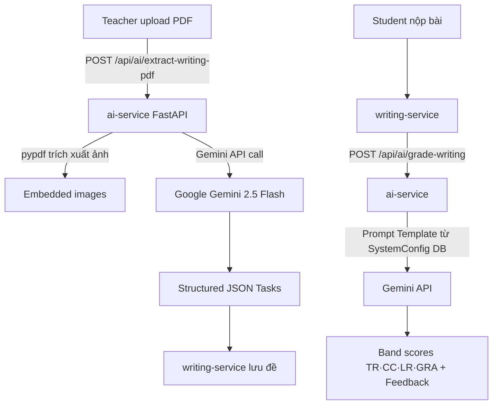
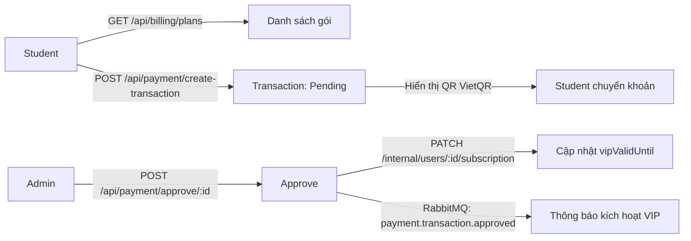

# Tài liệu Yêu cầu Sản phẩm (PRD)
## Nền tảng Luyện thi IELTS — Giai đoạn Pre-project

> **Phiên bản:** 1.0 · **Ngày cập nhật:** Tháng 5/2026  
> **Kiến trúc:** Microservices · Database-per-Service · RabbitMQ Event-Driven

---

## 1. Tầm nhìn Sản phẩm

Xây dựng một nền tảng luyện thi IELTS **toàn diện** giúp học viên tự học hiệu quả thông qua hệ thống thi thử 4 kỹ năng (Reading, Listening, Writing, Speaking), kết hợp:
- **Chấm điểm tự động tức thì** cho Reading & Listening.
- **Chấm điểm bởi Giáo viên** cho Writing & Speaking theo tiêu chí IELTS Band.
- **AI hỗ trợ** trích xuất đề thi từ PDF và tạo phản hồi học tập.
- **Hệ thống VIP** với kiểm soát truy cập dựa trên gói dịch vụ.

---

## 2. Bản đồ Tính năng Tổng quan

---

## 3. Đối tượng Người dùng

| Vai trò | Mô tả | Quyền hệ thống |
|:--------|:------|:---------------|
| **Student** | Học viên tự học, đăng ký gói FREE/VIP | Làm bài, nộp bài, xem kết quả của chính mình |
| **Teacher** | Giảng viên tạo đề, chấm bài Writing/Speaking | Tạo/sửa đề, xem queue chấm, nhập điểm |
| **Admin** | Quản trị viên toàn hệ thống | Mọi quyền Teacher + phê duyệt thanh toán + quản lý hệ thống |

---

## 4. Hành trình Người dùng

---

## 5. Epics & User Stories Chi tiết

### Epic 1 — Xác thực & Phân quyền (`auth-service`)

| Story ID | Mô tả | Điều kiện chấp nhận |
|:---------|:------|:--------------------|
| US-A01 | Học viên đăng ký bằng email/mật khẩu | Tài khoản được tạo với `role=Student`, `plan=FREE` |
| US-A02 | Người dùng đăng nhập nhận JWT | JWT có payload `{userId, role, plan}` |
| US-A03 | Admin thay đổi role người dùng | `PUT /api/users/:id/role` chỉ Admin được gọi |
| US-A04 | Admin khoá / mở tài khoản | `isActive` toggle, user bị khoá nhận 403 |

---

### Epic 2 — Luyện tập Reading (`reading-service`)

| Story ID | Mô tả | Loại câu hỏi hỗ trợ |
|:---------|:------|:--------------------|
| US-R01 | Teacher tạo đề Reading | MULTIPLE_CHOICE, FILL_IN_BLANK, MATCHING, TFNG, YNNG |
| US-R02 | Student xem danh sách đề (public) | Không cần đăng nhập |
| US-R03 | Student nộp bài → hệ thống tự chấm | `rawScore`, `bandScore` trả về ngay lập tức |
| US-R04 | Teacher/Admin xem tất cả attempts | `GET /api/reading/attempts` |
| US-R05 | AI tạo đề từ parameters | `POST /api/reading/generate-ai` |

---

### Epic 3 — Luyện tập Listening (`listening-service`)

| Story ID | Mô tả | Ghi chú |
|:---------|:------|:--------|
| US-L01 | Teacher tạo đề 4 Parts với audio URL | Part 1–4, mỗi part có `audioUrl` trên Cloudinary |
| US-L02 | Student nghe và trả lời | multiple_choice, fill_blank, map_labeling, matching |
| US-L03 | Nộp bài → auto-grade tức thì | Tương tự Reading |

---

### Epic 4 — Writing (`writing-service`) — Chấm thủ công bởi Teacher

| Tiêu chí chấm | Mô tả |
|:-------------|:------|
| **TR** — Task Response | Mức độ đáp ứng yêu cầu đề bài (0–9) |
| **CC** — Coherence & Cohesion | Tính mạch lạc, liên kết (0–9) |
| **LR** — Lexical Resource | Vốn từ vựng (0–9) |
| **GRA** — Grammatical Range & Accuracy | Ngữ pháp (0–9) |

---

### Epic 5 — Speaking (`speaking-service`) — Chấm thủ công bởi Teacher

| Cấu trúc bài thi | Nội dung |
|:----------------|:---------|
| **Part 1** | Mảng câu hỏi giao tiếp thông thường (p1_0, p1_1, …) |
| **Part 2** | Cue card — học viên nói về một chủ đề (p2) |
| **Part 3** | Mảng câu hỏi thảo luận nâng cao (p3_0, p3_1, …) |

| Tiêu chí chấm | Mô tả |
|:-------------|:------|
| **FC** — Fluency & Coherence | Sự trôi chảy, mạch lạc |
| **LR** — Lexical Resource | Vốn từ |
| **GRA** — Grammatical Range | Ngữ pháp |
| **PR** — Pronunciation | Phát âm |

---

### Epic 6 — Thi thử Mock Test (`exam-service`)

**Luồng skill trong một lần thi:**
- Exam chứa **4 `skillRefs`** (readingId, listeningId, writingId, speakingId).
- Mỗi kỹ năng có **thời gian riêng**: Reading 60', Listening 30', Writing 60', Speaking 15'.
- `SkillAttempt.autoSubmitted = true` khi hết giờ từng kỹ năng.
- `ExamAttempt.globalEndTime` = thời điểm hết hạn toàn bộ bài thi.

---

### Epic 7 — AI Grading & PDF Extraction (`ai-service`)

| Tính năng AI | Endpoint | Mô tả |
|:------------|:---------|:------|
| Trích xuất đề Writing từ PDF | `/api/ai/extract-writing-pdf` | pypdf → Gemini multimodal |
| Trích xuất đề Speaking từ PDF | `/api/ai/extract-speaking-pdf` | Gemini xử lý text từ PDF |
| Chấm Writing tự động | `/api/ai/grade-writing` | Prompt chuẩn IELTS → JSON band scores |
| Chấm Speaking tự động | `/api/ai/grade-speaking` | Tương tự Writing |
| Tạo đề Reading từ AI | `/api/reading/generate-ai` | Gemini generate câu hỏi |

**Cơ chế API Key:** Key được lưu trong `SystemConfig.geminiApiKey` (trên auth-service DB, `select: false`). AI service **fetch key qua internal endpoint** `/api/internal/system-config` mỗi request, không hardcode trong env.

---

### Epic 8 — Thanh toán VIP (`billing-service` + `payment-service`)

| Gói | Code | Skills | maxFullTests |
|:----|:-----|:-------|:------------|
| Miễn phí | FREE | reading, listening | 0 |
| Nâng cao | PLUS | reading, listening, writing | Giới hạn |
| Toàn diện | PRO | reading, listening, writing, speaking | Không giới hạn |

---

### Epic 9 — Thông báo Real-time (`notification-service`)

| Event RabbitMQ | Loại thông báo |
|:--------------|:---------------|
| `auth.user.registered` | Chào mừng tài khoản mới |
| `writing.submission.created` | Thông báo Teacher có bài chờ chấm |
| `writing.grading.completed` | Thông báo Student bài đã chấm xong |
| `speaking.grading.completed` | Tương tự Writing |
| `payment.transaction.approved` | VIP đã được kích hoạt |
| `payment.transaction.rejected` | Thanh toán bị từ chối |
| `reading.test.completed` | Hoàn thành bài Reading |
| `listening.test.completed` | Hoàn thành bài Listening |
| `billing.subscription.*` | Huỷ / Khôi phục subscription |

---

## 6. Ràng buộc Phi chức năng

| Loại | Yêu cầu |
|:-----|:--------|
| **Hiệu suất** | Chấm Reading/Listening trong < 1 giây sau khi nộp |
| **Độ tin cậy** | Notification failure không ảnh hưởng pipeline chấm bài |
| **Bảo mật** | JWT xác thực mọi route bảo vệ; Gemini API Key không bao giờ trả về client |
| **Khả năng mở rộng** | Mỗi service độc lập, scale riêng biệt |
| **Audit** | Mọi notification được log trong `NotificationLog` với `isRead`, `readAt` |
