# Minh Hoạ Chức Năng Chính — IELTS Master

> **Quy ước ảnh minh hoạ**
>
> - Tất cả ảnh lưu trong thư mục `screen-shot/` (cùng cấp với file này).
> - Chụp ở chế độ **full-size màn hình laptop 14 inch** (1920 × 1080 hoặc 1366 × 768), **không dùng chế độ popup / dialog riêng**.
> - Trình duyệt thu hết sidebar của OS (hoặc dùng chế độ Full Screen F11 trên Chrome/Edge) để thanh địa chỉ không che nội dung.
> - Tên file tuân theo quy ước `<số>-<tên-chức-năng>-<bước>.png`.

---

## Mục lục

| #  | Chức năng                               |
| -- | ----------------------------------------- |
| 1  | Đăng ký / Đăng nhập                 |
| 2  | Trang chủ & Dashboard học viên         |
| 3  | Luyện Reading                            |
| 4  | Luyện Listening & Dictation              |
| 5  | Luyện Writing (Chấm bằng giáo viên)  |
| 6  | Luyện Speaking (Chấm bằng giáo viên) |
| 7  | Thi thử toàn diện (Full Mock Test)     |
| 8  | Bài học (Lessons)                       |
| 9  | Lịch sử & Kết quả                     |
| 10 | Đăng ký gói & Thanh toán             |
| 11 | Quản lý (Teacher)                       |
| 12 | Quản trị hệ thống (Admin)             |

---

## 1. Đăng ký / Đăng nhập

### Luồng

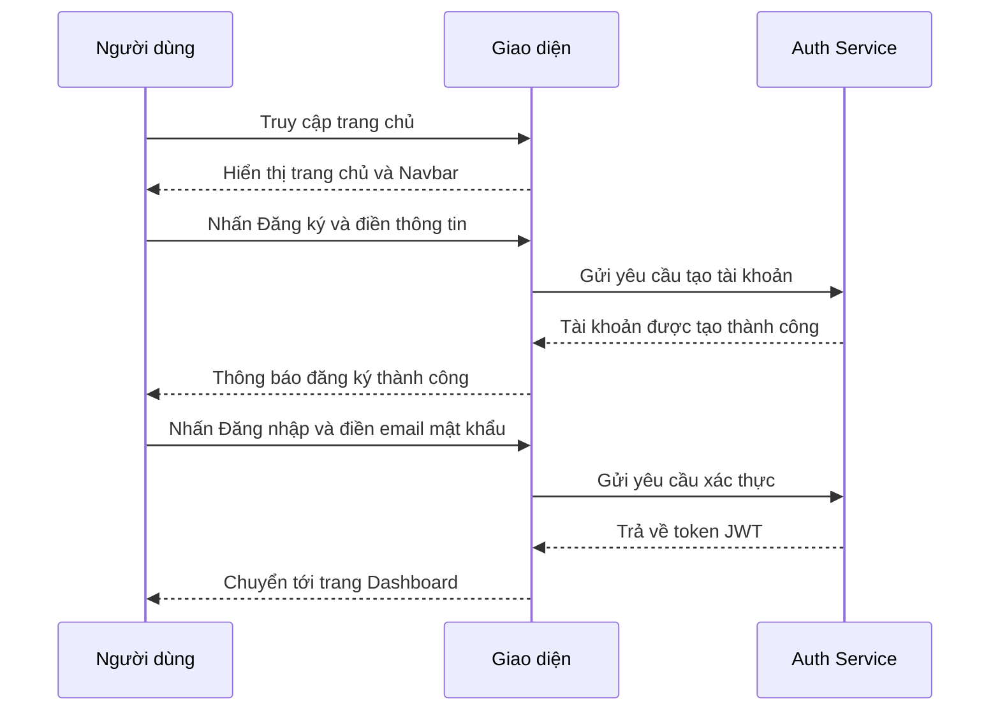
```mermaid
sequenceDiagram
    participant U as Người dùng
    participant FE as Giao diện
    participant Auth as Auth Service
    U->>FE: Truy cập trang chủ
    FE-->>U: Hiển thị trang chủ và Navbar
    U->>FE: Nhấn Đăng ký và điền thông tin
    FE->>Auth: Gửi yêu cầu tạo tài khoản
    Auth-->>FE: Tài khoản được tạo thành công
    FE-->>U: Thông báo đăng ký thành công
    U->>FE: Nhấn Đăng nhập và điền email mật khẩu
    FE->>Auth: Gửi yêu cầu xác thực
    Auth-->>FE: Trả về token JWT
    FE-->>U: Chuyển tới trang Dashboard
```

### Ảnh minh hoạ

| Bước | File ảnh                               | Mô tả                                                                     |
| ------ | --------------------------------------- | --------------------------------------------------------------------------- |
| 1      | `screen-shot/01-auth-homepage.png`    | Trang chủ, nút Đăng nhập / Đăng ký trên Navbar                     |
| 2      | `screen-shot/01-auth-login-modal.png` | Modal đăng nhập đang mở (chụp**toàn trang**, modal nằm giữa) |
| 3      | `screen-shot/01-auth-register.png`    | Trang `/register` — form đăng ký                                      |

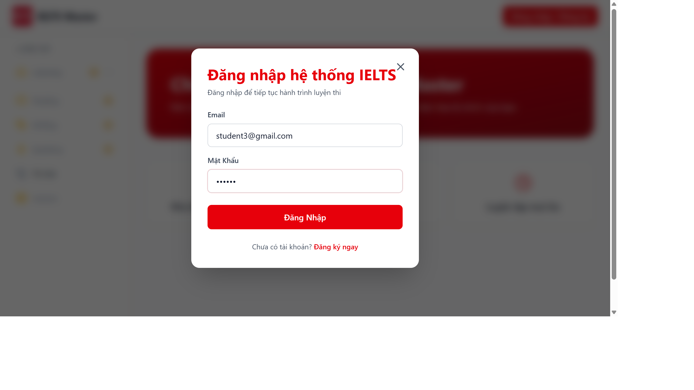

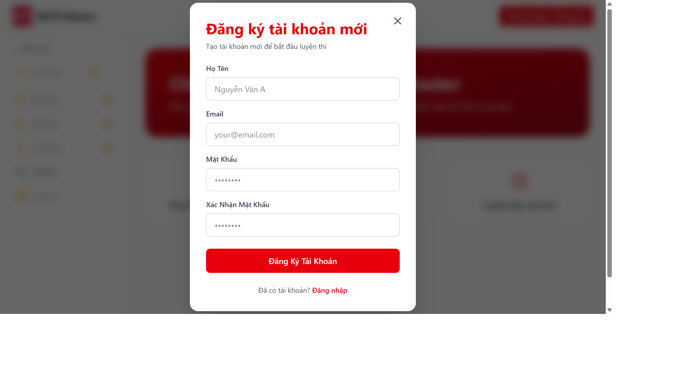

> **Lưu ý chụp ảnh:**
>
> - Đăng nhập dùng `AuthModal` nằm trên overlay toàn trang — chụp **full screen** thể hiện modal đè lên nội dung nền mờ, không crop riêng modal.
> - Đảm bảo thanh Navbar hiển thị đủ logo + nút "Đăng nhập" trước khi chụp bước 1.

---

## 2. Trang chủ & Dashboard học viên

### Luồng

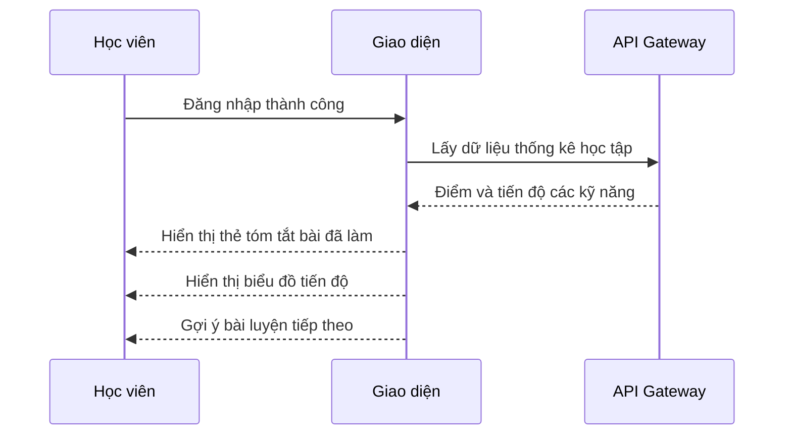
```mermaid
sequenceDiagram
    participant U as Học viên
    participant FE as Giao diện
    participant API as API Gateway
    U->>FE: Đăng nhập thành công
    FE->>API: Lấy dữ liệu thống kê học tập
    API-->>FE: Điểm và tiến độ các kỹ năng
    FE-->>U: Hiển thị thẻ tóm tắt bài đã làm
    FE-->>U: Hiển thị biểu đồ tiến độ
    FE-->>U: Gợi ý bài luyện tiếp theo
```

### Ảnh minh hoạ

| Bước | File ảnh                                 | Mô tả                                                   |
| ------ | ----------------------------------------- | --------------------------------------------------------- |
| 1      | `screen-shot/02-dashboard-student.png`  | Dashboard học viên sau khi đăng nhập                 |
| 2      | `screen-shot/02-dashboard-homepage.png` | Trang Landing `/` với banner & 3 tính năng nổi bật |

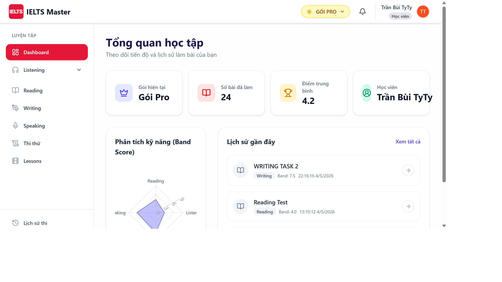

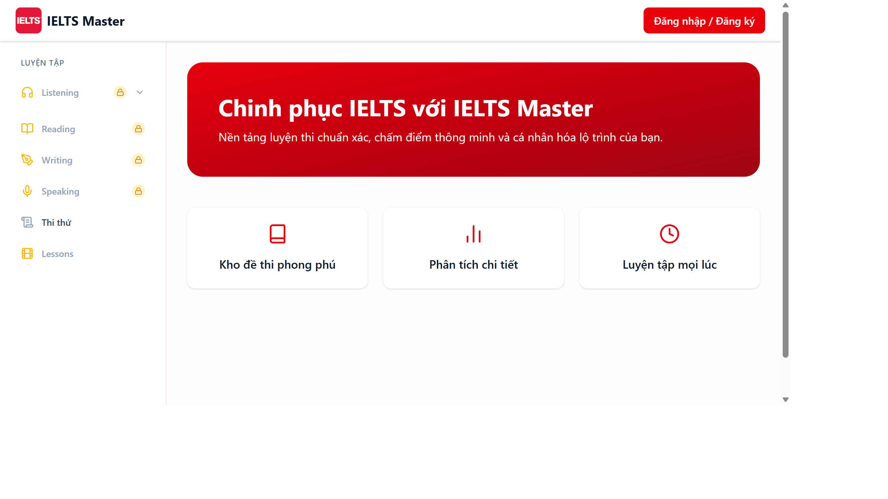

> **Lưu ý chụp ảnh:**
>
> - Chụp ở độ rộng đầy đủ để sidebar trái và vùng nội dung chính đều hiện.
> - Cuộn trang xuống nếu cần để thấy biểu đồ tiến độ (không cắt nội dung quan trọng).

---

## 3. Luyện Reading

### Luồng

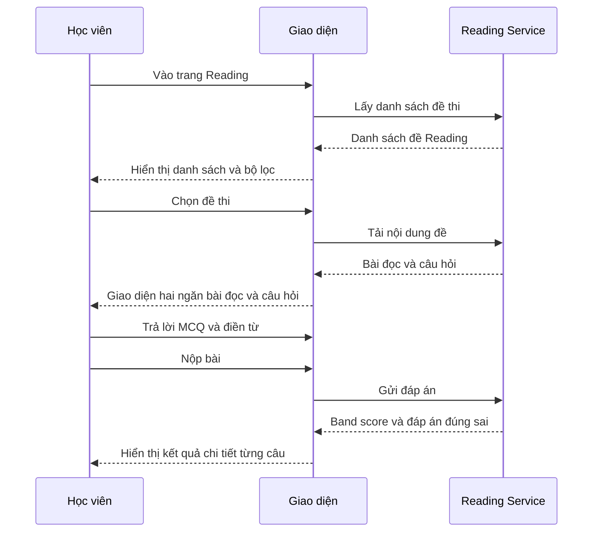
```mermaid
sequenceDiagram
    participant U as Học viên
    participant FE as Giao diện
    participant RS as Reading Service
    U->>FE: Vào trang Reading
    FE->>RS: Lấy danh sách đề thi
    RS-->>FE: Danh sách đề Reading
    FE-->>U: Hiển thị danh sách và bộ lọc
    U->>FE: Chọn đề thi
    FE->>RS: Tải nội dung đề
    RS-->>FE: Bài đọc và câu hỏi
    FE-->>U: Giao diện hai ngăn bài đọc và câu hỏi
    U->>FE: Trả lời MCQ và điền từ
    U->>FE: Nộp bài
    FE->>RS: Gửi đáp án
    RS-->>FE: Band score và đáp án đúng sai
    FE-->>U: Hiển thị kết quả chi tiết từng câu
```

### Ảnh minh hoạ

| Bước | File ảnh                           | Mô tả                                                             |
| ------ | ----------------------------------- | ------------------------------------------------------------------- |
| 1      | `screen-shot/03-reading-list.png` | Trang danh sách đề Reading, bộ lọc cấp độ                   |
| 2      | `screen-shot/03-reading-exam.png` | Giao diện làm bài split-pane (bài đọc trái, câu hỏi phải) |

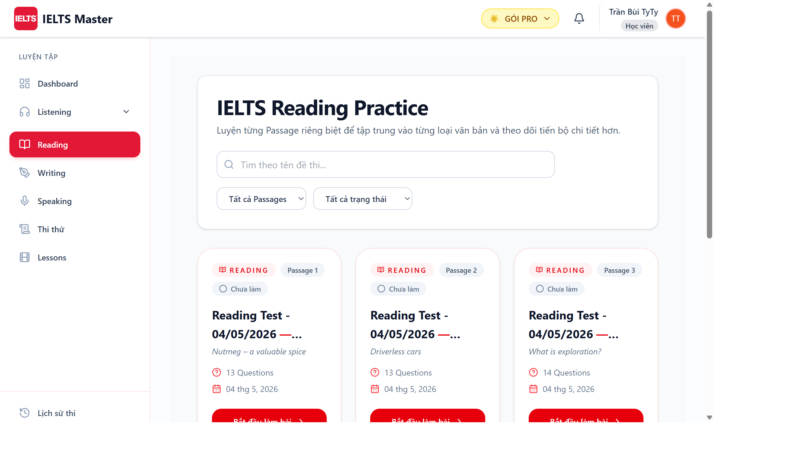

> **Lưu ý chụp ảnh:**
>
> - Trang làm bài dùng `react-split` hai ngăn — chụp **full screen** để thấy cả hai ngăn.
> - Đồng hồ đếm ngược góc trên phải phải hiện rõ.

---

## 4. Luyện Listening & Dictation

### Luồng

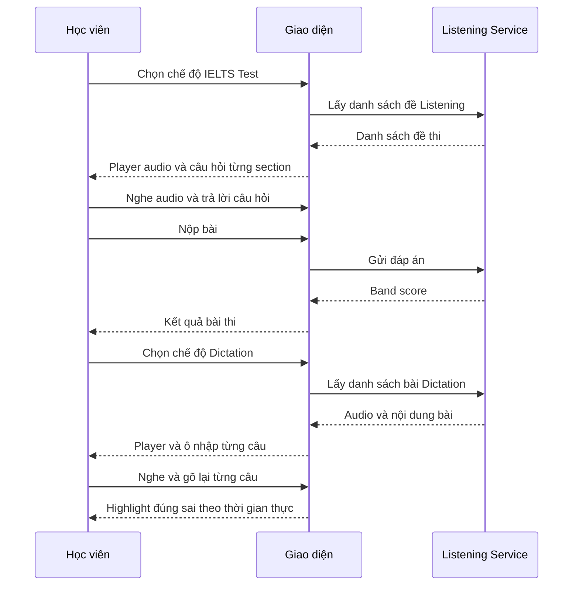
```mermaid
sequenceDiagram
    participant U as Học viên
    participant FE as Giao diện
    participant LS as Listening Service
    U->>FE: Chọn chế độ IELTS Test
    FE->>LS: Lấy danh sách đề Listening
    LS-->>FE: Danh sách đề thi
    FE-->>U: Player audio và câu hỏi từng section
    U->>FE: Nghe audio và trả lời câu hỏi
    U->>FE: Nộp bài
    FE->>LS: Gửi đáp án
    LS-->>FE: Band score
    FE-->>U: Kết quả bài thi
    U->>FE: Chọn chế độ Dictation
    FE->>LS: Lấy danh sách bài Dictation
    LS-->>FE: Audio và nội dung bài
    FE-->>U: Player và ô nhập từng câu
    U->>FE: Nghe và gõ lại từng câu
    FE-->>U: Highlight đúng sai theo thời gian thực
```

### Ảnh minh hoạ

| Bước | File ảnh                             | Mô tả                                                     |
| ------ | ------------------------------------- | ----------------------------------------------------------- |
| 1      | `screen-shot/04-listening-list.png` | Danh sách đề Listening                                   |
| 2      | `screen-shot/04-listening-exam.png` | Trang làm bài Listening, player audio + section câu hỏi |
| 3      | `screen-shot/04-dictation.png`      | Trang Dictation — audio player + ô gõ từng câu         |

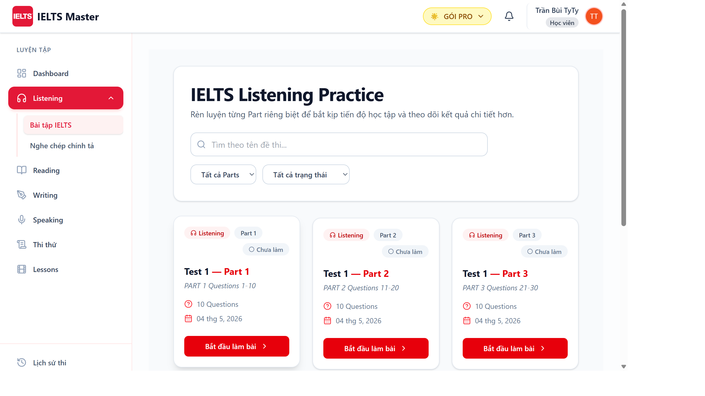

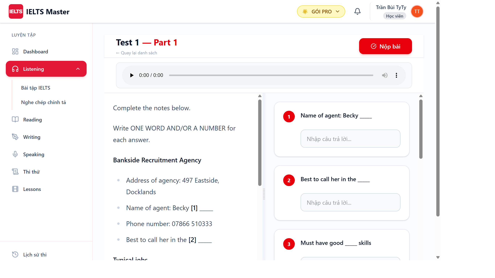

> **Lưu ý chụp ảnh:**
>
> - Audio player phải hiển thị, nên click Play trước rồi mới chụp để thanh tiến trình có màu.
> - Trang Dictation nên chụp khi đã gõ một vài câu để thấy highlight màu xanh/đỏ.

---

## 5. Luyện Writing (Chấm bằng giáo viên)

### Luồng

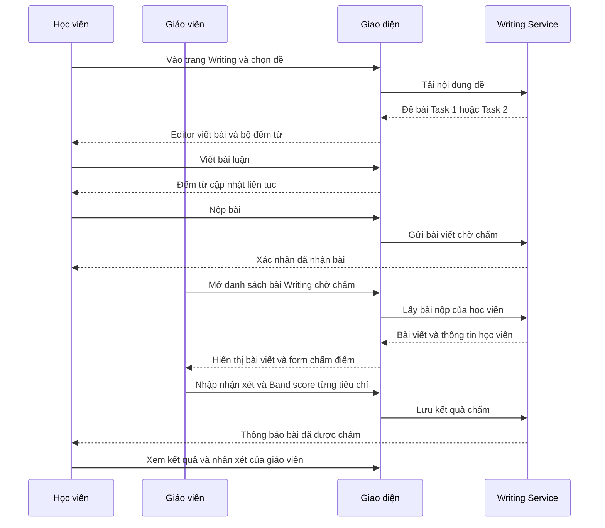
```mermaid
sequenceDiagram
    participant U as Học viên
    participant T as Giáo viên
    participant FE as Giao diện
    participant WS as Writing Service
    U->>FE: Vào trang Writing và chọn đề
    FE->>WS: Tải nội dung đề
    WS-->>FE: Đề bài Task 1 hoặc Task 2
    FE-->>U: Editor viết bài và bộ đếm từ
    U->>FE: Viết bài luận
    FE-->>U: Đếm từ cập nhật liên tục
    U->>FE: Nộp bài
    FE->>WS: Gửi bài viết chờ chấm
    WS-->>U: Xác nhận đã nhận bài
    T->>FE: Mở danh sách bài Writing chờ chấm
    FE->>WS: Lấy bài nộp của học viên
    WS-->>FE: Bài viết và thông tin học viên
    FE-->>T: Hiển thị bài viết và form chấm điểm
    T->>FE: Nhập nhận xét và Band score từng tiêu chí
    FE->>WS: Lưu kết quả chấm
    WS-->>U: Thông báo bài đã được chấm
    U->>FE: Xem kết quả và nhận xét của giáo viên
```

### Ảnh minh hoạ

| Bước | File ảnh                           | Mô tả                                                             |
| ------ | ----------------------------------- | ------------------------------------------------------------------- |
| 1      | `screen-shot/05-writing-list.png` | Danh sách đề Writing, lọc Task 1 / Task 2                       |
| 2      | `screen-shot/05-writing-exam.png` | Giao diện làm bài, đề bài trái + editor phải, bộ đếm từ |

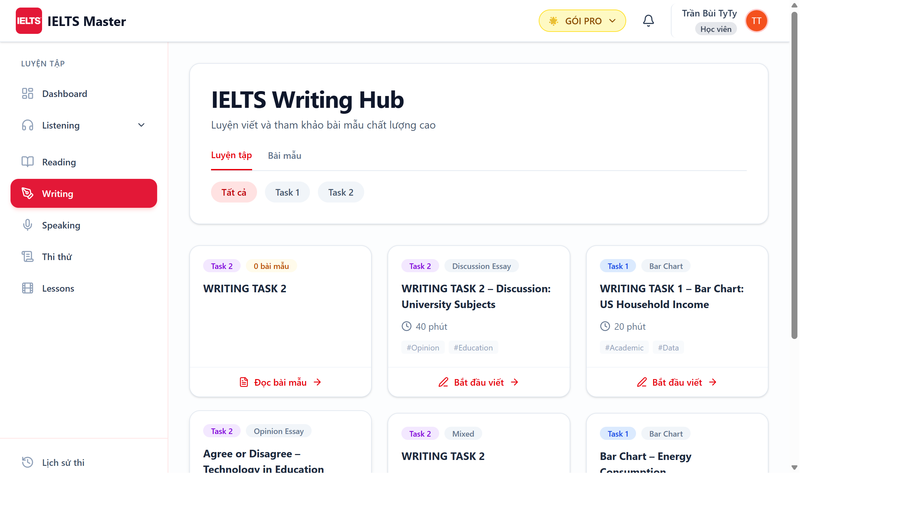

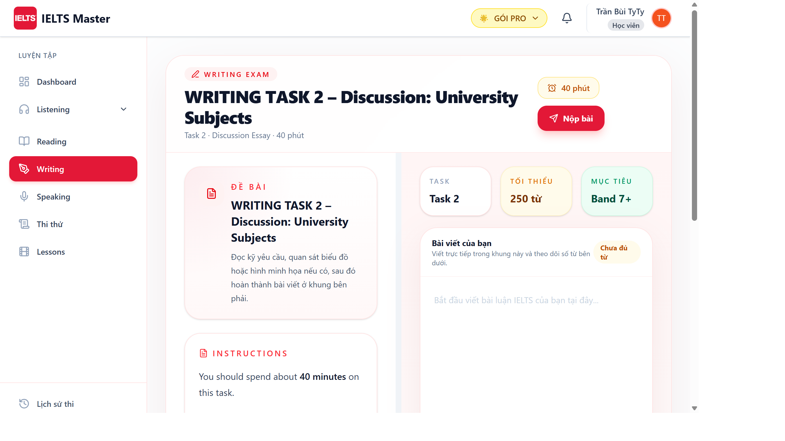

> **Lưu ý chụp ảnh:**
>
> - Chụp **sau khi gõ đủ ≥ 150 từ** để bộ đếm từ hiện màu xanh lá (đủ từ).
> - Trang kết quả cuộn đủ xuống để thấy cả 4 tiêu chí chấm điểm.

---

## 6. Luyện Speaking (Chấm bằng giáo viên)

### Luồng

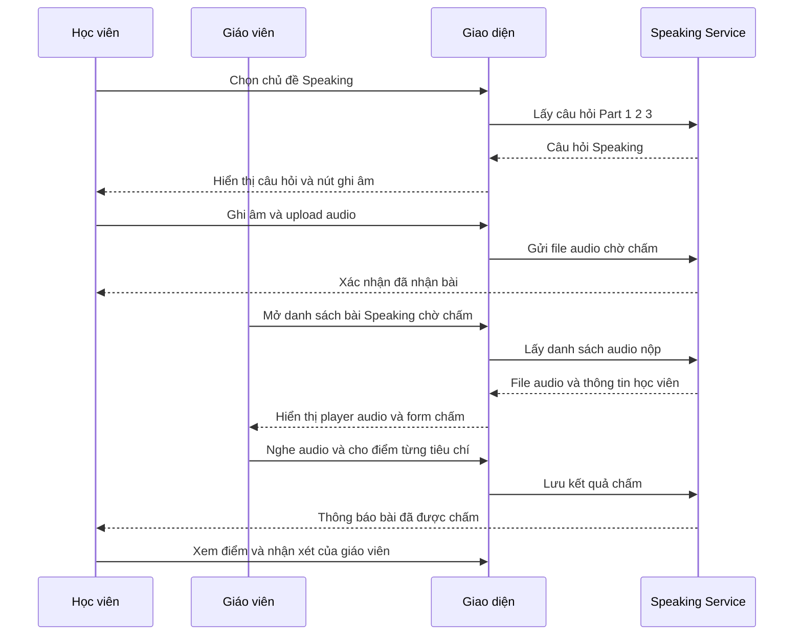
```mermaid
sequenceDiagram
    participant U as Học viên
    participant T as Giáo viên
    participant FE as Giao diện
    participant SS as Speaking Service
    U->>FE: Chọn chủ đề Speaking
    FE->>SS: Lấy câu hỏi Part 1 2 3
    SS-->>FE: Câu hỏi Speaking
    FE-->>U: Hiển thị câu hỏi và nút ghi âm
    U->>FE: Ghi âm và upload audio
    FE->>SS: Gửi file audio chờ chấm
    SS-->>U: Xác nhận đã nhận bài
    T->>FE: Mở danh sách bài Speaking chờ chấm
    FE->>SS: Lấy danh sách audio nộp
    SS-->>FE: File audio và thông tin học viên
    FE-->>T: Hiển thị player audio và form chấm
    T->>FE: Nghe audio và cho điểm từng tiêu chí
    FE->>SS: Lưu kết quả chấm
    SS-->>U: Thông báo bài đã được chấm
    U->>FE: Xem điểm và nhận xét của giáo viên
```

### Ảnh minh hoạ

| Bước | File ảnh                                | Mô tả                                                            |
| ------ | ---------------------------------------- | ------------------------------------------------------------------ |
| 1      | `screen-shot/06-speaking-list.png`     | Danh sách chủ đề Speaking                                      |
| 2      | `screen-shot/06-speaking-practice.png` | Trang luyện Speaking, câu hỏi + nút ghi âm đang hoạt động |

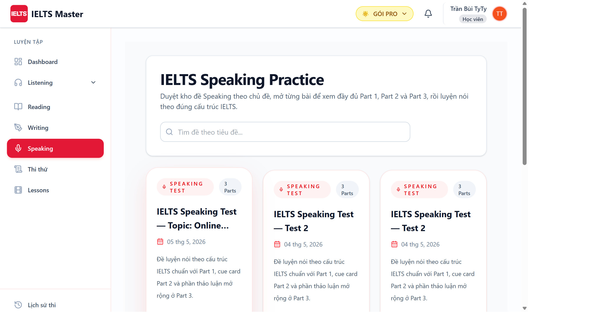

> **Lưu ý chụp ảnh:**
>
> - Trước khi chụp bước 2 hãy nhấn nút **Bắt đầu ghi âm** để trạng thái "đang ghi" hiện ra (chấm đỏ hoặc sóng âm thanh).
> - Cần cấp quyền microphone cho trình duyệt trước khi chụp.

---

## 7. Thi thử toàn diện (Full Mock Test)

### Luồng

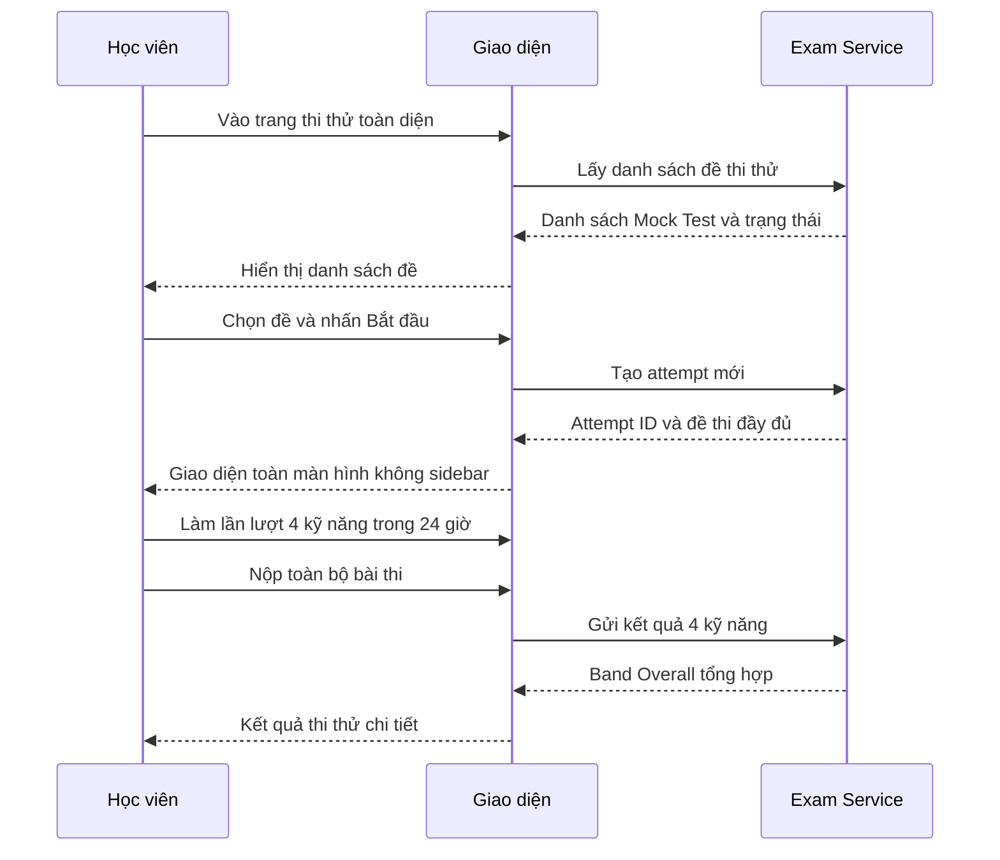
```mermaid
sequenceDiagram
    participant U as Học viên
    participant FE as Giao diện
    participant ES as Exam Service
    U->>FE: Vào trang thi thử toàn diện
    FE->>ES: Lấy danh sách đề thi thử
    ES-->>FE: Danh sách Mock Test và trạng thái
    FE-->>U: Hiển thị danh sách đề
    U->>FE: Chọn đề và nhấn Bắt đầu
    FE->>ES: Tạo attempt mới
    ES-->>FE: Attempt ID và đề thi đầy đủ
    FE-->>U: Giao diện toàn màn hình không sidebar
    U->>FE: Làm lần lượt 4 kỹ năng trong 24 giờ
    U->>FE: Nộp toàn bộ bài thi
    FE->>ES: Gửi kết quả 4 kỹ năng
    ES-->>FE: Band Overall tổng hợp
    FE-->>U: Kết quả thi thử chi tiết
```

### Ảnh minh hoạ

| Bước | File ảnh                        | Mô tả                                                                                  |
| ------ | -------------------------------- | ---------------------------------------------------------------------------------------- |
| 1      | `screen-shot/07-mock-list.png` | Danh sách đề thi thử, badge trạng thái (Chưa bắt đầu / Đang làm / Đã nộp) |

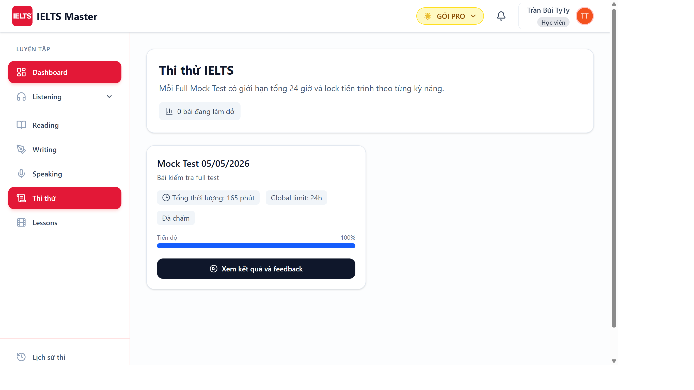

> **Lưu ý chụp ảnh:**
>
> - Trang làm bài thi thử dùng `NavOnlyLayout` (ẩn sidebar) — chụp **full screen F11** để thấy toàn bộ không gian làm bài.
> - Chụp bước 2 khi timer đang chạy để thể hiện đồng hồ đếm ngược.

---

## 8. Bài học (Lessons)

### Luồng

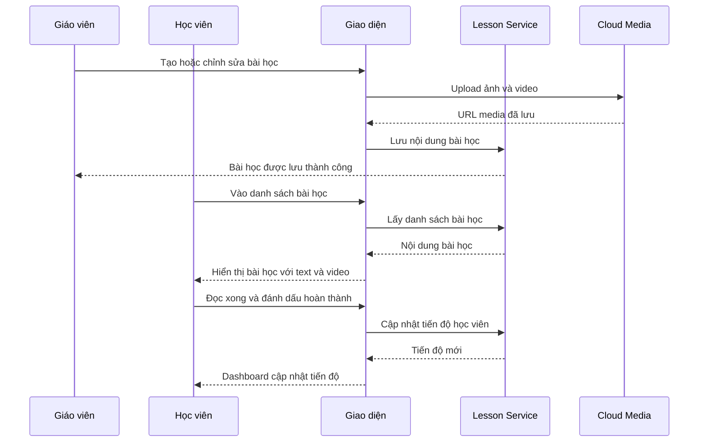
```mermaid
sequenceDiagram
    participant T as Giáo viên
    participant U as Học viên
    participant FE as Giao diện
    participant LS as Lesson Service
    participant CM as Cloud Media
    T->>FE: Tạo hoặc chỉnh sửa bài học
    FE->>CM: Upload ảnh và video
    CM-->>FE: URL media đã lưu
    FE->>LS: Lưu nội dung bài học
    LS-->>T: Bài học được lưu thành công
    U->>FE: Vào danh sách bài học
    FE->>LS: Lấy danh sách bài học
    LS-->>FE: Nội dung bài học
    FE-->>U: Hiển thị bài học với text và video
    U->>FE: Đọc xong và đánh dấu hoàn thành
    FE->>LS: Cập nhật tiến độ học viên
    LS-->>FE: Tiến độ mới
    FE-->>U: Dashboard cập nhật tiến độ
```

### Ảnh minh hoạ

| Bước | File ảnh                          | Mô tả                                                |
| ------ | ---------------------------------- | ------------------------------------------------------ |
| 1      | `screen-shot/08-lesson-list.png` | Trang danh sách bài học, phân loại theo chủ đề |

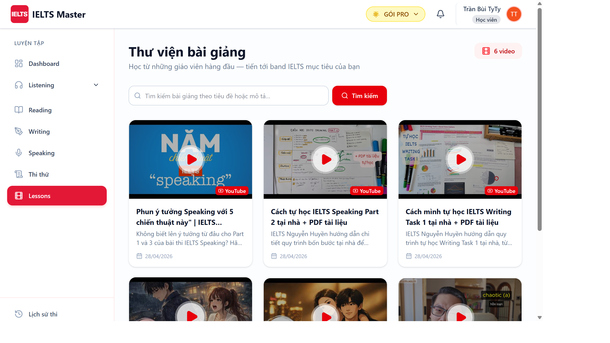

> **Lưu ý chụp ảnh:**
>
> - Cuộn xuống nếu bài học dài để thấy phần video embed + nội dung chính.
> - Đảm bảo đã đăng nhập để nút "Đánh dấu hoàn thành" hiện.

---

## 9. Lịch sử & Kết quả

### Luồng

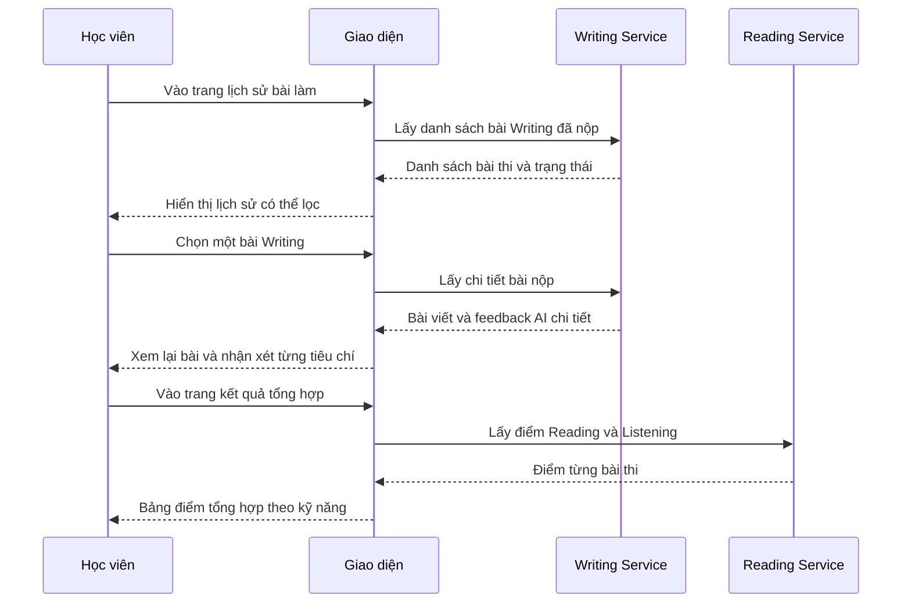
```mermaid
sequenceDiagram
    participant U as Học viên
    participant FE as Giao diện
    participant WS as Writing Service
    participant RS as Reading Service
    U->>FE: Vào trang lịch sử bài làm
    FE->>WS: Lấy danh sách bài Writing đã nộp
    WS-->>FE: Danh sách bài thi và trạng thái
    FE-->>U: Hiển thị lịch sử có thể lọc
    U->>FE: Chọn một bài Writing
    FE->>WS: Lấy chi tiết bài nộp
    WS-->>FE: Bài viết và feedback AI chi tiết
    FE-->>U: Xem lại bài và nhận xét từng tiêu chí
    U->>FE: Vào trang kết quả tổng hợp
    FE->>RS: Lấy điểm Reading và Listening
    RS-->>FE: Điểm từng bài thi
    FE-->>U: Bảng điểm tổng hợp theo kỹ năng
```

### Ảnh minh hoạ

| Bước | File ảnh                             | Mô tả                                          |
| ------ | ------------------------------------- | ------------------------------------------------ |
| 1      | `screen-shot/09-history-list.png`   | Danh sách lịch sử bài làm                   |
| 2      | `screen-shot/09-history-detail.png` | Chi tiết bài Writing đã nộp + nhận xét AI |
| 3      | `screen-shot/09-results.png`        | Trang kết quả Reading/Listening tổng hợp     |

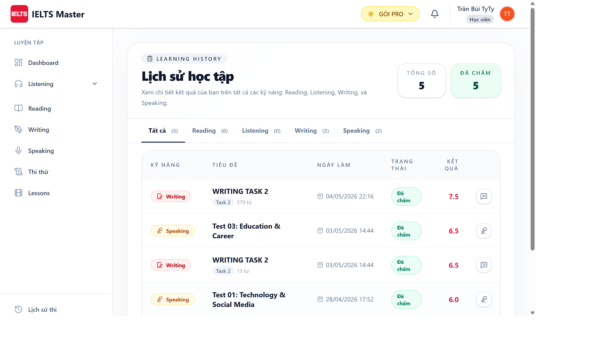

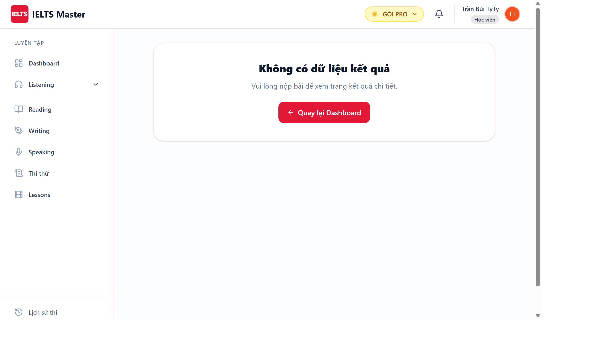

> **Lưu ý chụp ảnh:**
>
> - Cần có ít nhất 2–3 bài đã nộp để danh sách lịch sử không trống.

---

## 10. Đăng ký gói & Thanh toán

### Luồng

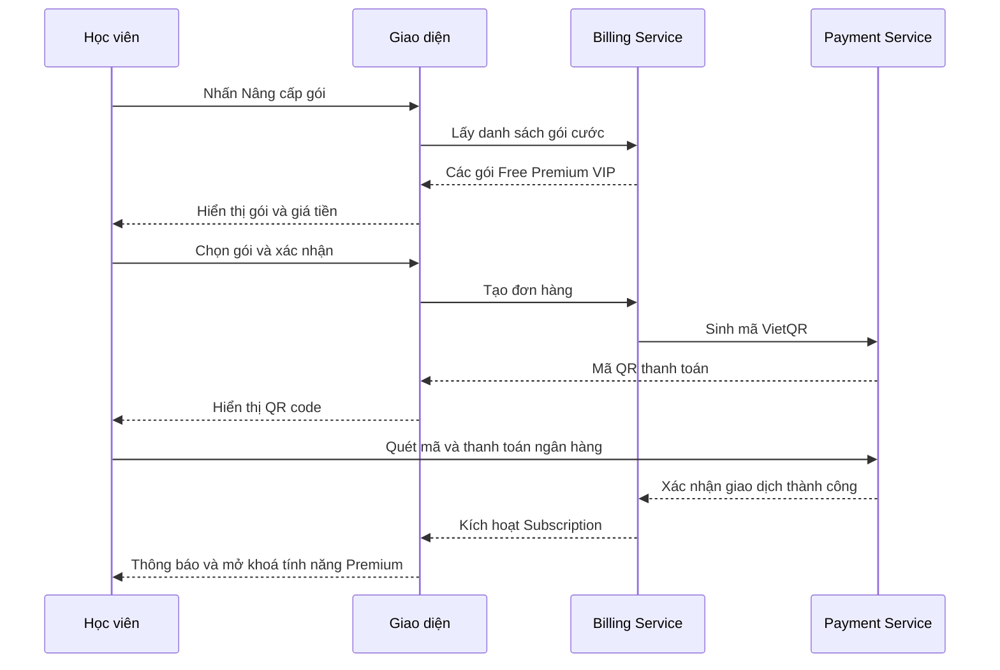
```mermaid
sequenceDiagram
    participant U as Học viên
    participant FE as Giao diện
    participant BS as Billing Service
    participant PS as Payment Service
    U->>FE: Nhấn Nâng cấp gói
    FE->>BS: Lấy danh sách gói cước
    BS-->>FE: Các gói Free Premium VIP
    FE-->>U: Hiển thị gói và giá tiền
    U->>FE: Chọn gói và xác nhận
    FE->>BS: Tạo đơn hàng
    BS->>PS: Sinh mã VietQR
    PS-->>FE: Mã QR thanh toán
    FE-->>U: Hiển thị QR code
    U->>PS: Quét mã và thanh toán ngân hàng
    PS-->>BS: Xác nhận giao dịch thành công
    BS-->>FE: Kích hoạt Subscription
    FE-->>U: Thông báo và mở khoá tính năng Premium
```

### Ảnh minh hoạ

| Bước | File ảnh                            | Mô tả                                               |
| ------ | ------------------------------------ | ----------------------------------------------------- |
| 1      | `screen-shot/10-billing-plans.png` | Modal/trang danh sách gói với giá và tính năng |

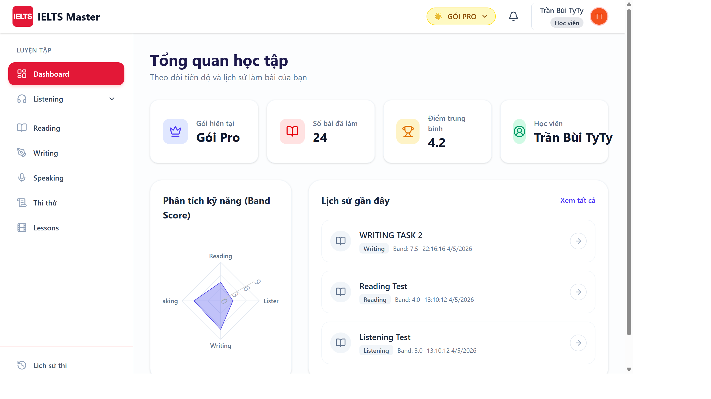

> **Lưu ý chụp ảnh:**
>
> - `CheckoutModal` là overlay toàn trang — chụp **full screen** để thấy nền mờ phía sau.
> - Chụp QR sao cho mã vạch rõ nét (không blur).
> - Trang `/payment-success` có thể là redirect sau webhook — chụp ngay khi vừa redirect đến.

---

## 11. Quản lý (Teacher Dashboard)

### Luồng

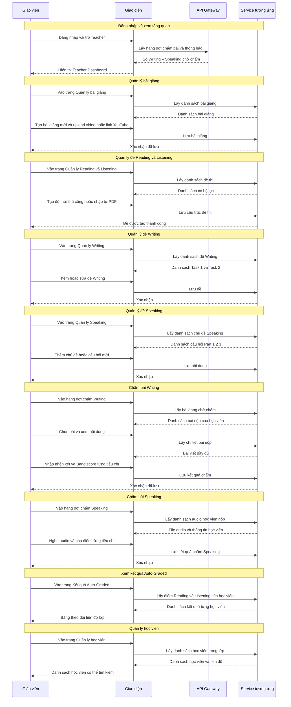
```mermaid
sequenceDiagram
    participant T as Giáo viên
    participant FE as Giao diện
    participant API as API Gateway
    participant SV as Service tương ứng

    Note over T,SV: Đăng nhập và xem tổng quan
    T->>FE: Đăng nhập vài trò Teacher
    FE->>API: Lấy hàng đợi chấm bài và thông báo
    API-->>FE: Số Writing – Speaking chờ chấm
    FE-->>T: Hiển thị Teacher Dashboard

    Note over T,SV: Quản lý bài giảng
    T->>FE: Vào trang Quản lý bài giảng
    FE->>SV: Lấy danh sách bài giảng
    SV-->>FE: Danh sách bài giảng
    T->>FE: Tạo bài giảng mới và upload video hoặc link YouTube
    FE->>SV: Lưu bài giảng
    SV-->>T: Xác nhận đã lưu

    Note over T,SV: Quản lý đề Reading và Listening
    T->>FE: Vào trang Quản lý Reading và Listening
    FE->>SV: Lấy danh sách đề thi
    SV-->>FE: Danh sách có bộ lọc
    T->>FE: Tạo đề mới thủ công hoặc nhập từ PDF
    FE->>SV: Lưu cấu trúc đề thi
    SV-->>T: Đề được tạo thành công

    Note over T,SV: Quản lý đề Writing
    T->>FE: Vào trang Quản lý Writing
    FE->>SV: Lấy danh sách đề Writing
    SV-->>FE: Danh sách Task 1 và Task 2
    T->>FE: Thêm hoặc sửa đề Writing
    FE->>SV: Lưu đề
    SV-->>T: Xác nhận

    Note over T,SV: Quản lý đề Speaking
    T->>FE: Vào trang Quản lý Speaking
    FE->>SV: Lấy danh sách chủ đề Speaking
    SV-->>FE: Danh sách câu hỏi Part 1 2 3
    T->>FE: Thêm chủ đề hoặc câu hỏi mới
    FE->>SV: Lưu nội dung
    SV-->>T: Xác nhận

    Note over T,SV: Chấm bài Writing
    T->>FE: Vào hàng đợi chấm Writing
    FE->>SV: Lấy bài đang chờ chấm
    SV-->>FE: Danh sách bài nộp của học viên
    T->>FE: Chọn bài và xem nội dung
    FE->>SV: Lấy chi tiết bài nộp
    SV-->>FE: Bài viết đầy đủ
    T->>FE: Nhập nhận xét và Band score từng tiêu chí
    FE->>SV: Lưu kết quả chấm
    SV-->>T: Xác nhận đã lưu

    Note over T,SV: Chấm bài Speaking
    T->>FE: Vào hàng đợi chấm Speaking
    FE->>SV: Lấy danh sách audio học viên nộp
    SV-->>FE: File audio và thông tin học viên
    T->>FE: Nghe audio và cho điểm từng tiêu chí
    FE->>SV: Lưu kết quả chấm Speaking
    SV-->>T: Xác nhận

    Note over T,SV: Xem kết quả Auto-Graded
    T->>FE: Vào trang Kết quả Auto-Graded
    FE->>SV: Lấy điểm Reading và Listening của học viên
    SV-->>FE: Danh sách kết quả từng học viên
    FE-->>T: Bảng theo dõi tiến độ lớp

    Note over T,SV: Quản lý học viên
    T->>FE: Vào trang Quản lý học viên
    FE->>SV: Lấy danh sách học viên trong lớp
    SV-->>FE: Danh sách học viên và tiến độ
    FE-->>T: Danh sách học viên có thể tìm kiếm
```

### Ảnh minh hoạ

| Bước | File ảnh                                       | Mô tả                                                                       |
| ------ | ----------------------------------------------- | ----------------------------------------------------------------------------- |
| 1      | `screen-shot/11-teacher-dashboard.png`        | Teacher Dashboard — thống kê tổng quan lớp                               |
| 2      | `screen-shot/11-teacher-test-mgmt.png`        | Trang quản lý đề thi Reading/Listening, bảng danh sách + nút tạo mới |
| 3      | `screen-shot/11-teacher-grading.png`          | GradingDashboard — danh sách bài Writing chờ chấm                        |
| 4      | `screen-shot/11-teacher-grading-detail.png`   | Quản lý học viên                                                          |
| 5      | `screen-shot/11-teacher-speaking-grading.png` | Trang chấm Speaking — player audio + form cho điểm                        |
| 6      | `screen-shot/11-teacher-mock-builder.png`     | Mock Exam Builder — giao diện tạo đề thi thử                            |
| 7      | `screen-shot/11-teacher-pdf-extract.png`      | AI PDF Extractor — upload PDF tự động phân tích câu hỏi               |

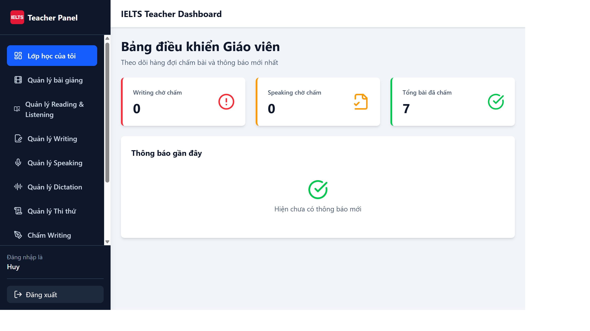

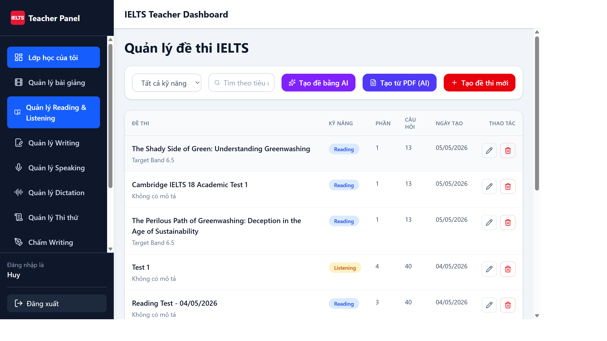

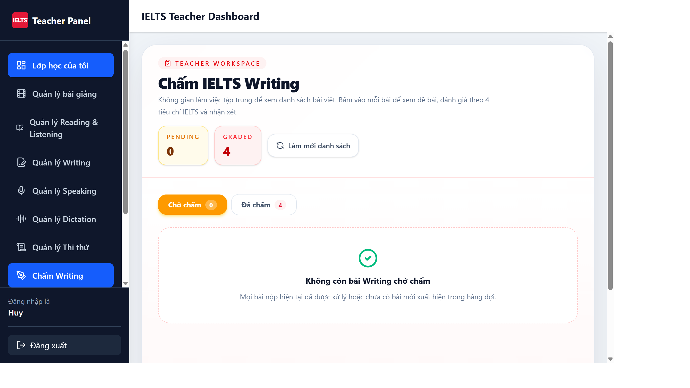

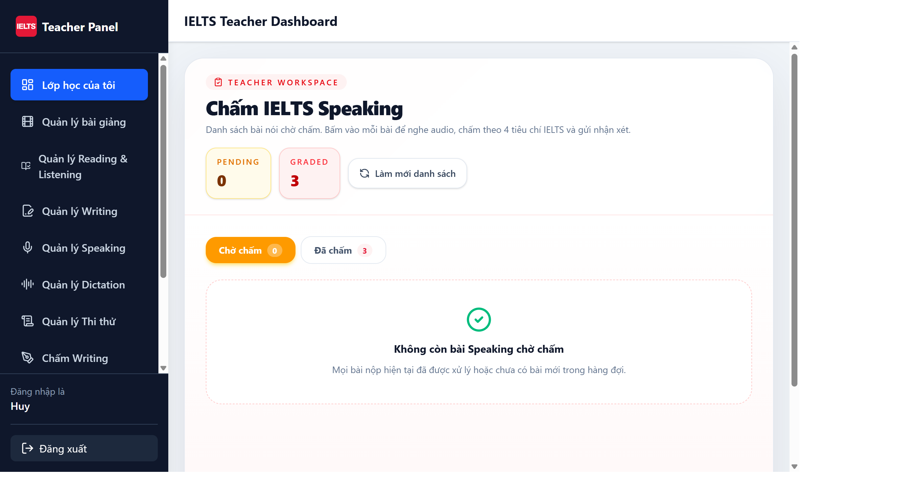

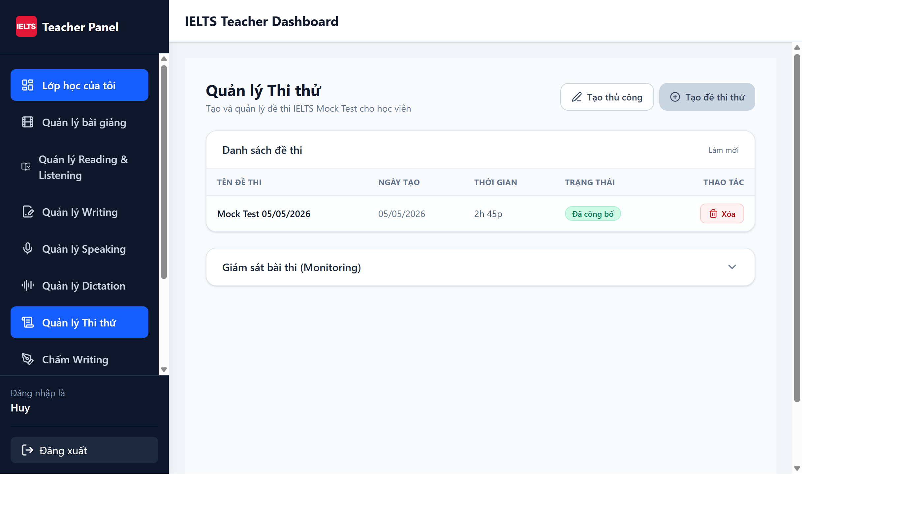

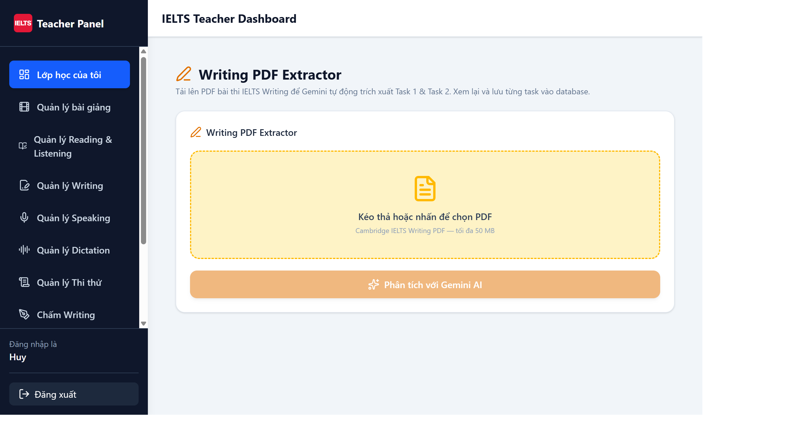

> **Lưu ý chụp ảnh:**
>
> - Đăng nhập bằng tài khoản role `teacher` trước khi chụp.
> - Với trang Grading, cần có ít nhất 1 bài nộp đang chờ chấm.
> - Trang PDF Extractor chụp sau khi upload file PDF để thấy kết quả phân tích (không chụp khi màn hình trống).

---

## 12. Quản trị hệ thống (Admin Dashboard)

### Luồng

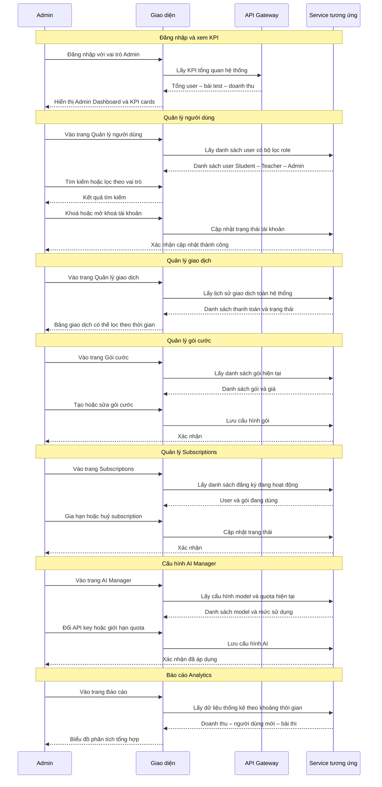
```mermaid
sequenceDiagram
    participant A as Admin
    participant FE as Giao diện
    participant API as API Gateway
    participant SV as Service tương ứng

    Note over A,SV: Đăng nhập và xem KPI
    A->>FE: Đăng nhập với vai trò Admin
    FE->>API: Lấy KPI tổng quan hệ thống
    API-->>FE: Tổng user – bài test – doanh thu
    FE-->>A: Hiển thị Admin Dashboard và KPI cards

    Note over A,SV: Quản lý người dùng
    A->>FE: Vào trang Quản lý người dùng
    FE->>SV: Lấy danh sách user có bộ lọc role
    SV-->>FE: Danh sách user Student – Teacher – Admin
    A->>FE: Tìm kiếm hoặc lọc theo vai trò
    FE-->>A: Kết quả tìm kiếm
    A->>FE: Khoá hoặc mở khoá tài khoản
    FE->>SV: Cập nhật trạng thái tài khoản
    SV-->>A: Xác nhận cập nhật thành công

    Note over A,SV: Quản lý giao dịch
    A->>FE: Vào trang Quản lý giao dịch
    FE->>SV: Lấy lịch sử giao dịch toàn hệ thống
    SV-->>FE: Danh sách thanh toán và trạng thái
    FE-->>A: Bảng giao dịch có thể lọc theo thời gian

    Note over A,SV: Quản lý gói cước
    A->>FE: Vào trang Gói cước
    FE->>SV: Lấy danh sách gói hiện tại
    SV-->>FE: Danh sách gói và giá
    A->>FE: Tạo hoặc sửa gói cước
    FE->>SV: Lưu cấu hình gói
    SV-->>A: Xác nhận

    Note over A,SV: Quản lý Subscriptions
    A->>FE: Vào trang Subscriptions
    FE->>SV: Lấy danh sách đăng ký đang hoạt động
    SV-->>FE: User và gói đang dùng
    A->>FE: Gia hạn hoặc huỷ subscription
    FE->>SV: Cập nhật trạng thái
    SV-->>A: Xác nhận

    Note over A,SV: Cấu hình AI Manager
    A->>FE: Vào trang AI Manager
    FE->>SV: Lấy cấu hình model và quota hiện tại
    SV-->>FE: Danh sách model và mức sử dụng
    A->>FE: Đổi API key hoặc giới hạn quota
    FE->>SV: Lưu cấu hình AI
    SV-->>A: Xác nhận đã áp dụng

    Note over A,SV: Báo cáo Analytics
    A->>FE: Vào trang Báo cáo
    FE->>SV: Lấy dữ liệu thống kê theo khoảng thời gian
    SV-->>FE: Doanh thu – người dùng mới – bài thi
    FE-->>A: Biểu đồ phân tích tổng hợp
```

### Ảnh minh hoạ

| Bước | File ảnh                                  | Mô tả-                                                     |
| ------ | ------------------------------------------ | ------------------------------------------------------------ |
| 1      | `screen-shot/12-admin-dashboard.png`     | Admin Dashboard — KPI cards + biểu đồ tổng quan         |
| 2      | `screen-shot/12-admin-users.png`         | Trang quản lý người dùng — bảng danh sách + bộ lọc |
| 3      | `screen-shot/12-admin-billing-plans.png` | Quản lý gói đăng ký — danh sách gói + giá          |
| 4      | `screen-shot/12-admin-ai-manager.png`    | AI Manager — cấu hình model, API key, quota               |
| 5      | `screen-shot/12-admin-analytics.png`     | Báo cáo Analytics — biểu đồ doanh thu & người dùng  |

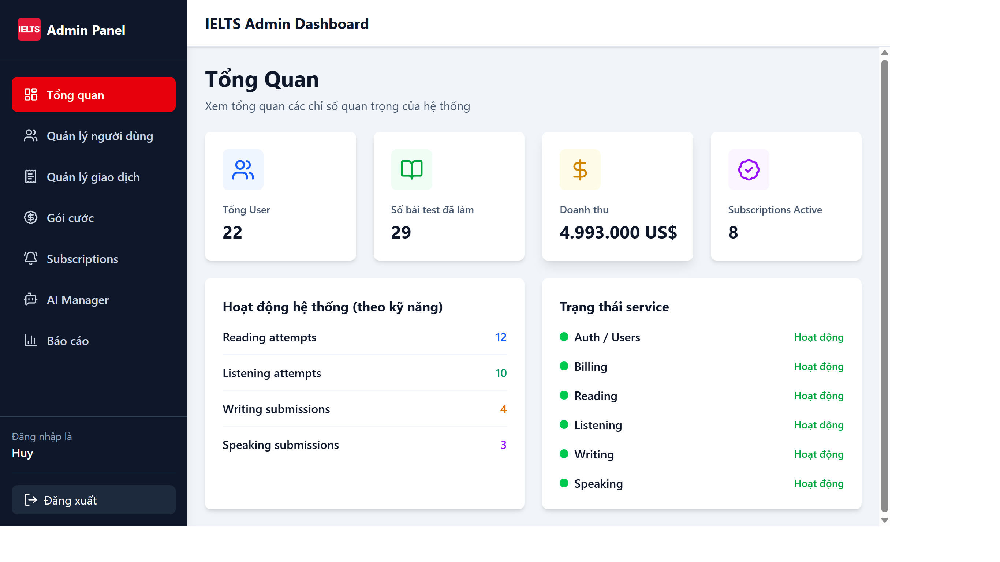

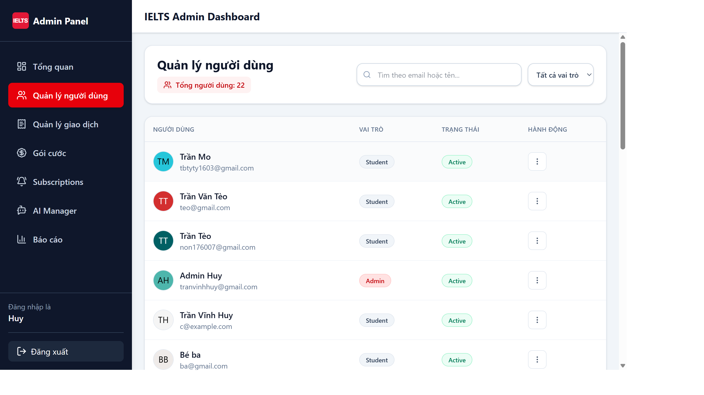

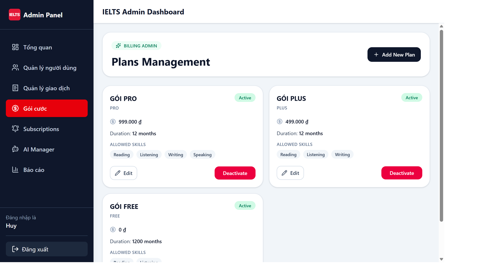

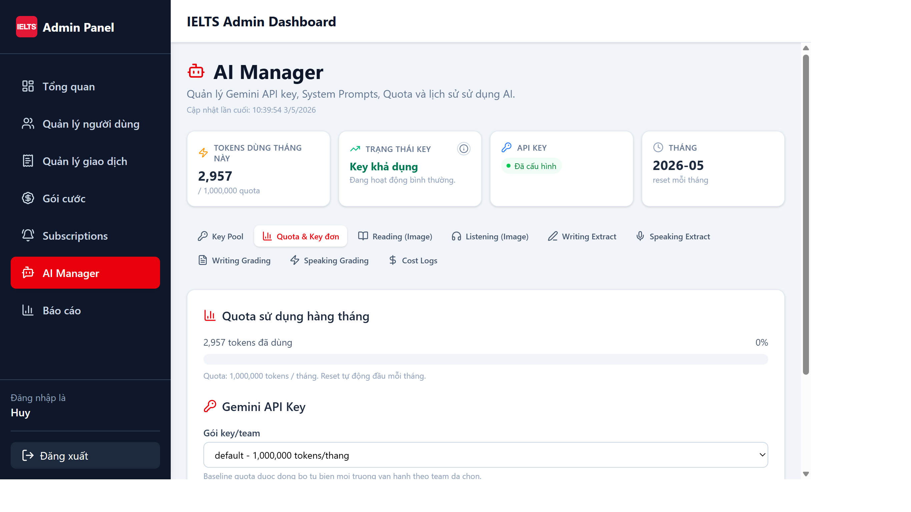

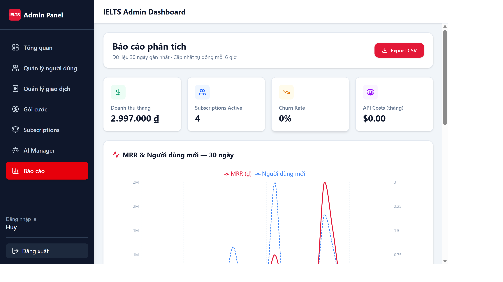

> **Lưu ý chụp ảnh:**
>
> - Đăng nhập bằng tài khoản role `admin`.
> - Dashboard admin dùng `AdminLayout` (sidebar riêng màu tối) — chụp **full screen** để thấy cả sidebar và vùng nội dung.
> - Trang Analytics cuộn đủ để thấy ít nhất 2 biểu đồ.

---

## Hướng dẫn chụp ảnh màn hình (tổng quát)

| Hạng mục              | Yêu cầu                                                                                                           |
| ----------------------- | ------------------------------------------------------------------------------------------------------------------- |
| **Thiết bị**    | Laptop 14 inch, độ phân giải 1920×1080 hoặc 1366×768                                                         |
| **Trình duyệt** | Chrome / Edge, phóng to 100%,**Full Screen (F11)**                                                           |
| **Chế độ**     | Không dùng Responsive mode hoặc cửa sổ thu nhỏ                                                                |
| **Đăng nhập**  | Luôn đăng nhập đúng role (student / teacher / admin) trước khi chụp                                        |
| **Dữ liệu**     | Đảm bảo có dữ liệu mẫu (bài thi, bài nộp) để không chụp màn hình trống                             |
| **Định dạng**  | PNG, tên file theo quy ước `<số>-<chức-năng>-<bước>.png`                                                  |
| **Chú thích**   | Dùng công cụ như Greenshot / Snagit để thêm mũi tên/khung đỏ đánh dấu vùng quan trọng sau khi chụp |
